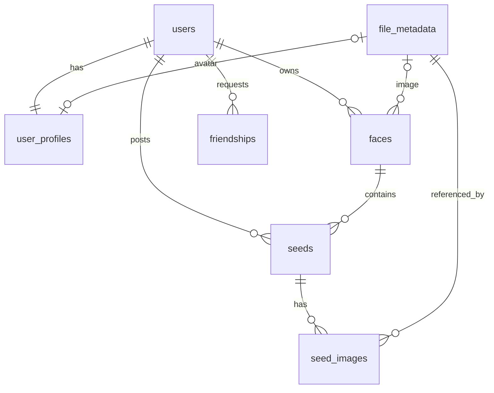

_This project has been created as part of the 42 curriculum by hurabe, nkawaguc, katakada, kharuya._

<!-- ## 2. Description
- プロジェクトの目的(goal)と簡潔な概要を明確に提示する。
- プロジェクトの明確な名前を含める。
- 主要な機能（key features）を含める。 -->

# Description

**MultiFace** は、ユーザーの「多面性」を単位として日々のアクティビティを書き留めるための、個人向けのアクティビティログサービスです。

## 目的

「他者とつながること」を中心に設計されたサービスでは、投稿するほど他者の視線を意識してしまいます。MultiFace はそうしたソーシャルネットワークを目指しておらず、いいね・リプライ・メンションといった反応機能を意図的に持ちません。**自分の好きなことを他人のリアクションを意識せずに書き留めること**自体を目的としたサービスです。

MultiFace では、ユーザーは自分の関心や役割に応じた複数の「**フェイス**（多面性）」を持ち、その時々の内容に合ったフェイスへ投稿します。読書のフェイス、映画のフェイス、日記のフェイス——といった形で、1 つのアカウントの中で文脈を分けて記録できます。

## 主要機能

- **認証**: サインアップ / サインイン / サインアウト / トークンリフレッシュ（JWT + リフレッシュトークン、httpOnly Cookie 保存）
- **フェイス**: 多面性ごとのカテゴリを作成し、公開 / 非公開を設定できる
- **シード（アクティビティ）**: フェイスに紐づく投稿。本文と複数画像の添付に対応
- **フレンドシップ**: 申請 / 承認 / ブロック / 解除、フレンド一覧・保留中申請一覧
- **プレゼンス**: Redis を用いたオンライン状態の管理と表示
- **ユーザープロフィール**: 表示名・バッジ・アバター画像の管理
- **ファイルストレージ**: 画像のアップロード / ダウンロード / 削除（public / private バケット分離）
- **多言語対応**: 英語・フランス語・日本語の 3 言語（`next-intl`）
- **運用基盤**: Prometheus + Grafana によるメトリクス監視、ELK によるログ可視化

<!-- ## 3. Instructions
- コンパイル・インストール・実行に関する情報を記載する。
- 必要な前提条件をすべて挙げる（ソフトウェア、ツール、バージョン、`.env` 設定などの構成情報）。
- プロジェクトを動かすための手順を段階的に書く。 -->

# Instruction

## 前提条件

| 項目    | バージョン / 条件                                                     |
| ------- | --------------------------------------------------------------------- |
| Docker  | Docker Desktop または OrbStack が起動していること                     |
| VS Code | Dev Containers 拡張が有効であること                                   |
| Node.js | 24（Dev Container 内で提供）                                          |
| pnpm    | 11.16.0（`packageManager` にピン留め済み。corepack 経由で自動有効化） |
| mkcert  | 本番相当環境（local-prod）を動かす場合のみ必要                        |

開発環境の実行は **VS Code Dev Container** を推奨します。本番相当環境のデプロイ操作（docker / mkcert / hosts 変更）は**ホスト OS 側**で実行してください（Dev Container は編集用途です）。

## 環境変数

本リポジトリは環境変数ファイルを使用します。用途ごとに 2 種類あり、いずれも例ファイルをコピーして作成します。

```bash
cp .env.dev.example .env.dev               # 開発環境用
cp .env.local-prod.example .env.local-prod # 本番相当環境用
```

主な変数は次のとおりです（詳細は各 `.example` ファイルを参照）。

| 変数                                                   | 説明                                                              |
| ------------------------------------------------------ | ----------------------------------------------------------------- |
| `NODE_ENV`                                             | 実行モード（development / production）                            |
| `POSTGRES_DB` / `POSTGRES_USER` / `POSTGRES_PASSWORD`  | PostgreSQL の接続情報                                             |
| `DATABASE_URL`                                         | バックエンド（Drizzle / postgres.js）が使う接続 URL               |
| `RUN_MIGRATIONS`                                       | 起動時にマイグレーションを自動実行するか                          |
| `REDIS_PASSWORD`                                       | Redis の認証パスワード                                            |
| `PEPPER`                                               | パスワードハッシュに付与するペッパー（秘密値）                    |
| `JWT_ISSUER`                                           | JWT の issuer                                                     |
| `ACCESS_TOKEN_EXPIRES_IN` / `REFRESH_TOKEN_EXPIRES_IN` | トークンの有効期限                                                |
| `FILE_STORAGE_BASE_DIR`                                | アップロードファイルの保存先ディレクトリ                          |
| `APP_API_BASE_URL`                                     | BFF（Next.js サーバー）から backend を呼ぶベース URL              |
| `NEXT_PUBLIC_BFF_API_BASE_URL`                         | ブラウザから BFF API を呼ぶベース URL（クライアントに公開される） |
| `GF_SECURITY_ADMIN_PASSWORD` ほか                      | Grafana / Elasticsearch / Kibana / Logstash の設定                |

## 開発環境の起動

1. VS Code でリポジトリを開く
2. **Reopen in Container** を実行する
3. 初回起動時に `postCreateCommand` で `pnpm install` が実行される

Dev Container の起動と同時に、`docker-compose.dev.yml` の各サービスが立ち上がります。

- アプリケーション: `dev-container` / `frontend` / `backend` / `nginx` / `db` / `redis`
- 監視: `prometheus` / `grafana` / `alertmanager` と各 exporter（node / cAdvisor / postgres / redis / nginx）
- ログ可視化（`analytics` プロファイル指定時のみ）: `elasticsearch` / `kibana` / `logstash` / `filebeat`

ルートから直接開発サーバーを起動する場合は次を実行します。

```bash
pnpm dev
```

## 動作確認

| 用途                              | URL                                |
| --------------------------------- | ---------------------------------- |
| ブラウザ入口（Nginx 経由）        | http://localhost:8080              |
| Next.js 直アクセス                | http://localhost:3000              |
| Hono API 直アクセス（デバッグ用） | http://localhost:8000/api/v1/hello |
| BFF API                           | http://localhost:8080/api/hello    |
| PostgreSQL                        | localhost:5432                     |
| Redis                             | localhost:6379                     |
| Grafana                           | http://localhost:3001              |
| Prometheus                        | http://localhost:9090              |
| Alertmanager                      | http://localhost:9093              |
| Kibana（analytics プロファイル）  | http://localhost:8080/kibana       |

Nginx は `/api/*` と `/*` をいずれも `frontend:3000` に転送し、必要に応じて BFF が `backend:8000` を呼び出します。

## 本番相当環境（local-prod）の実行

ローカル PC 上で、ビルド済みイメージ + ローカルレジストリ + HTTPS という本番に近い構成を 1 コマンドで起動します。

### 手順 1: hosts を設定

ホスト OS の `/etc/hosts` に以下を追加します。

```
127.0.0.1 tracen.local registry.tracen.local api.tracen.local
```

### 手順 2: TLS 資材を生成

```bash
mkcert -install
pnpm local-prod:setup-tls
```

### 手順 3: Docker にローカルレジストリの CA を信頼させる

```bash
sudo mkdir -p /etc/docker/certs.d/registry.tracen.local:5000
sudo cp containers/infra/local-prod/certs/ca.crt /etc/docker/certs.d/registry.tracen.local:5000/ca.crt
```

環境によっては Docker の再起動が必要です。

### 手順 4: デプロイと確認

```bash
cp .env.local-prod.example .env.local-prod
pnpm local-prod:deploy
```

- 入口: https://tracen.local
- BFF API: https://tracen.local/api/hello

### 停止とクリーンアップ

```bash
docker compose -f docker-compose.dev.yml down   # 開発環境
pnpm local-prod:down                            # 本番相当環境
```

### 補足

- `docker-compose.local-prod.yml` は既定で HTTPS（443）のみを公開します。HTTP→HTTPS リダイレクトが必要な場合は `80:80` の公開を追加してください。
- rootless Docker などで 443 の公開が難しい場合は 8443 等に変更してください。
- `.local` が環境の名前解決と衝突する場合は `tracen.test` などへ切り替えてください（hosts / 証明書 SAN / compose の alias も同様に変更が必要です）。

## トラブルシューティング: Nginx が 502 になる場合

起動直後やコンテナ再作成後に `http://localhost:8080` が 502 Bad Gateway になることがあります。

1. 直アクセスで切り分ける。`http://localhost:3000`（Next.js）と `http://localhost:8000/api/v1/hello`（API）が表示されるか確認する
2. 起動直後は dev server の起動待ちで 502 になるため、数十秒待って再読み込みする
3. 直アクセスは成功し nginx だけ 502 の場合は nginx を再起動する

   ```bash
   docker compose -f docker-compose.dev.yml restart nginx
   ```

4. 原因が分からない場合はログと状態を確認する

   ```bash
   docker compose -f docker-compose.dev.yml ps
   docker compose -f docker-compose.dev.yml logs -f --tail=200 nginx frontend backend
   ```

`containers/infra/nginx/nginx.conf` を編集した場合、反映には nginx の再起動が必要です。同ファイルには Docker DNS（127.0.0.11）で upstream を再解決する設定を入れており、コンテナ再起動による IP 変化に伴う 502 を防いでいます。

<!-- ## 4. Resources
- テーマに関連する定番の参考資料を列挙する（ドキュメント、記事、チュートリアル等）。
- AI をどのように使ったかの説明を含める。どのタスクに、プロジェクトのどの部分に使ったかを明示する。 -->

# Resources

## 参考資料

### サービスコンセプト

- 見るより気兼ねなく書く、Trickle というサービス
- Trickle の機能紹介（アクティビティログサービス）
- 見る・話すより、書くこと自体を楽しむサービス「Trickle」

### 技術ドキュメント

- Next.js App Router / React Server Components 公式ドキュメント
- Hono 公式ドキュメント（RPC / zod validator / node-server）
- Drizzle ORM 公式ドキュメント（スキーマ定義・マイグレーション）
- PostgreSQL / Redis 公式ドキュメント
- Nginx リバースプロキシ・TLS 設定ドキュメント
- Prometheus / Grafana / Alertmanager 公式ドキュメント
- Elastic Stack（Elasticsearch / Logstash / Kibana / Filebeat）公式ドキュメント
- mkcert（ローカル CA によるローカル HTTPS）

### プロジェクト内ドキュメント

| ドキュメント                                | 内容                                                                |
| ------------------------------------------- | ------------------------------------------------------------------- |
| `docs/architecture/ARCHITECTURE.md`         | プロジェクト全体アーキテクチャ                                      |
| `docs/architecture/BACKEND_ARCHITECTURE.md` | バックエンドの層構成と設計方針                                      |
| `docs/api/BFF_API_GUIDE.md`                 | BFF API の設計方針                                                  |
| `docs/api/backend/*.md`                     | バックエンド API 仕様（friendship / face・seed）                    |
| `docs/contracts/CONTRACTS_GUIDE.md`         | 共有型・スキーマの運用ガイド                                        |
| `docs/deploy/LOCAL_PROD_DEPLOYMENT.md`      | 本番相当環境のデプロイ手順                                          |
| `docs/test/LOCAL_CI_LOCAL_PROD.md`          | ローカル CI の実行方法                                              |
| `docs/test/VITEST_BACKEND_SETUP.md`         | バックエンドのテスト構成                                            |
| `docs/for_dev/*.md`                         | Lint / Prettier / EditorConfig / Git hooks / セキュリティ例外ルール |
| `containers/infra/monitoring/README.md`     | 監視基盤の構成                                                      |
| `containers/infra/analytics/README.md`      | ログ可視化基盤の構成                                                |

## AI の利用について

本プロジェクトでは、開発補助として生成 AI（Claude Code / GitHub Copilot）を継続的に利用しました。

### AI を使ったタスク

| 対象             | 使い方                                                                                                                       |
| ---------------- | ---------------------------------------------------------------------------------------------------------------------------- |
| Issue 起票       | `.claude/skills/github-create-issue`、`.github/agents/issue-creator.agent.md` によりテンプレートに沿った Issue を作成        |
| 実装補助         | `.claude/skills/github-impl-issue`、`.github/agents/issue-implementer.agent.md` により Issue 単位で実装を進行                |
| コミット / PR    | `.claude/skills/github-commit`、`.claude/skills/github-make-pr`、`.github/skills/*` によりコミットメッセージと PR 記述を統一 |
| 技術調査         | `.claude/skills/web-search` により外部情報を調査                                                                             |
| ドキュメント作成 | `docs/` 配下の設計・手順ドキュメントの草案作成とレビュー                                                                     |

### 人が判断した領域

- アーキテクチャの最終決定、モジュール選定、DB スキーマの確定
- セキュリティ・認証・シークレットに関わる変更の可否判断
- 依存パッケージの脆弱性対応方針（例外運用を含む）

<!-- ## 5. Team Information
README 冒頭に挙げた各チームメンバーについて、以下を書く。
- 割り当てられた役割（PO、PM、Tech Lead、Developers 等）
- その責務の簡潔な説明 -->

# Team Information

- hurabe (PM+Developers)
- nkawaguc (PO+Developers): サービスコンセプトの立案、プロダクト方向性の決定
- katakada (Tech Lead+Developers)
- kharuya (Developers)

<!-- ## 6. Project Management
- チームがどのように作業を組織したか（タスク分担、ミーティング等）
- プロジェクト管理に使ったツール（GitHub Issues、Trello 等）
- 使用したコミュニケーションチャネル（Discord、Slack 等） -->

# Project Management

## タスク管理

タスクはすべて **GitHub Issues** で管理しました。起票の粒度と記述内容を揃えるため、空の Issue を禁止（`blank_issues_enabled: false`）し、次の 6 種類のテンプレートを用意しています。

- `bug_report`（不具合報告）
- `feature_request`（機能追加）
- `documentation`（ドキュメント）
- `performance`（性能改善）
- `refactor`（リファクタリング）
- `ui_ux_improvement`（UI / UX 改善）

作業は「Issue 起票 → ブランチ作成 → 実装 → PR → レビュー → マージ」の流れで進め、Issue 単位で担当を割り当てました。

## ラベル運用

Issue には接頭辞付きのラベルを付与し、「どこの領域を」「どの優先度で」「どの規模で」やるのかを一目で判別できるようにしました。これにより、担当の割り振りと着手順の判断をラベルの絞り込みだけで行えます。

| カテゴリ | ラベル                                                                                                   | 用途                                     |
| -------- | -------------------------------------------------------------------------------------------------------- | ---------------------------------------- |
| 領域     | `area:frontend` / `area:backend` / `area:contracts` / `area:db` / `area:infra` / `area:ci` / `area:docs` | 変更が及ぶレイヤーを示す                 |
| 優先度   | `priority:p0` 〜 `priority:p3`                                                                           | 着手順の判断                             |
| 規模     | `size:XS` / `size:S` / `size:M` / `size:L`                                                               | 見積もりと分割の目安                     |
| 課題対応 | `mandatory` / `module:major` / `module:minor`                                                            | 必須要件とモジュールの対応付け           |
| その他   | `epic` / `type:design` / `onboarding` / `question`                                                       | 大きなまとまり、設計検討、環境構築、質問 |

## コミュニケーション

- **Discord**: 日常的な相談・進捗共有。監視基盤の Alertmanager からのアラートも Discord に通知される
- **ドキュメント**: 決定事項や手順は口頭で終わらせず `docs/` 配下に残す運用

## 品質ゲート

CI サーバーではなく、**Git hooks とローカル CI** で品質を担保しています。

| タイミング   | 実行内容                                                                                                          |
| ------------ | ----------------------------------------------------------------------------------------------------------------- |
| `pre-commit` | `lint-staged`（ESLint + Prettier）、`pnpm audit`、`secrets:scan`（gitleaks）、`osv:scan-lockfiles`（OSV-Scanner） |
| `pre-push`   | `pnpm typecheck`、`pnpm local-ci:fast`（本番相当環境のビルド・起動・スモークテスト・後片付け）                    |
| 任意         | `pnpm local-ci:full`（より広い範囲の検証）                                                                        |

ローカル CI は `docker-compose.local-prod.yml` を実際に起動し、`https://tracen.local/api/health` とトップページの疎通までを確認します。これにより、開発中の変更が本番相当のデプロイを壊していないかを早期に検知できます。

## セキュリティ運用

- 依存パッケージの脆弱性は `pnpm audit` と OSV-Scanner で検出し、`pnpm-workspace.yaml` の `overrides` で安全なバージョンに固定
- 直ちに解消できない脆弱性は、期限を区切って扱う運用ルール（`docs/for_dev/SECURITY_EXCEPTION_3DAY_RULE.md`）を定義
- コミット前に gitleaks でシークレットの混入を検査

<!-- ## 7. Technical Stack
- 使用したフロントエンドの技術・フレームワーク
- 使用したバックエンドの技術・フレームワーク
- データベースシステムと、それを選んだ理由
- その他の重要な技術・ライブラリ
- 主要な技術的選択の正当化s-->

# Technical Stack

## 構成図

```
ブラウザ
  │  HTTP（開発） / HTTPS（本番相当）
  ▼
Nginx（リバースプロキシ）
  │
  ▼
frontend-bff（Next.js）
  - React Server / Client Components
  - Server Actions / Route Handlers
  - server/usecases + repositories
  │  Hono RPC（サーバー間のみ）
  ▼
backend（Hono）
  ├─▶ PostgreSQL
  └─▶ Redis
```

## 採用技術

| レイヤー                | 技術                                                                                                           |
| ----------------------- | -------------------------------------------------------------------------------------------------------------- |
| フロントエンド / BFF    | Next.js 16（App Router）、React 19、Tailwind CSS 4、next-intl、react-hook-form、Zod、lucide-react、Storybook 8 |
| バックエンド            | Hono 4、@hono/node-server、Vite、@hono/zod-validator、pino                                                     |
| 型・スキーマ共有        | `@tracen/contracts`（Zod スキーマ）、Hono RPC クライアント（`hc`）                                             |
| データベース            | PostgreSQL 17、Drizzle ORM、postgres.js、drizzle-kit                                                           |
| キャッシュ / 短命データ | Redis 8（ioredis）                                                                                             |
| 認証                    | argon2（+ ペッパー）、JWT、JWKS 公開エンドポイント、jose                                                       |
| リバースプロキシ        | Nginx 1.27（開発: HTTP、本番相当: HTTPS + upstream 証明書検証）                                                |
| 監視                    | Prometheus、Grafana、Alertmanager、各種 exporter                                                               |
| ログ可視化              | Elasticsearch、Logstash、Kibana、Filebeat                                                                      |
| テスト                  | Vitest、シェルスクリプトによる API テスト、local-prod スモークテスト                                           |
| 開発環境                | Docker Compose、Dev Container、pnpm workspaces、ローカル Docker レジストリ、mkcert                             |
| 品質管理                | ESLint 9、Prettier 3、EditorConfig、husky、lint-staged、gitleaks、OSV-Scanner                                  |

## 技術選定の理由

### モノレポ + 共有スキーマパッケージ

フロントエンドとバックエンドで API の型がずれることを、レビューではなく仕組みで防ぎたいという理由から、pnpm workspaces のモノレポ構成を採用しました。リクエスト / レスポンスの形は `@tracen/contracts` に Zod スキーマとして 1 か所で定義し、バックエンドは実行時バリデーションに、フロントエンドは型とフォーム検証に同じ定義を使います。契約を変更すると、両側で型エラーとして即座に検出されます。

### BFF パターン（Next.js）

ブラウザからバックエンド API を直接叩かせず、Next.js のサーバー側（Route Handler / Server Actions / usecases）を必ず経由させる構成にしました。これにより、アクセストークンを httpOnly Cookie に閉じ込めたまま扱え、画面都合のデータ整形をバックエンドの API 設計に持ち込まずに済みます。バックエンドは本番相当構成では外部へ直接公開されません。

### Hono

バックエンドには軽量かつ TypeScript との親和性が高い Hono を採用しました。決め手は **RPC 機能**で、ルーター定義からクライアント側の型が導出されるため、BFF からの呼び出しがエンドポイント単位で型安全になります。Zod バリデータとの統合により、契約パッケージのスキーマをそのまま入力検証に使える点も選定理由です。

### PostgreSQL

データモデルの中心が「ユーザー・フェイス・シード・フレンドシップ」という明確な関係を持つ構造であり、参照整合性・複合ユニーク制約・列挙型・インデックス設計が要件に直結します。これらを宣言的に表現でき、外部キーのカスケード削除まで DB 側で保証できるリレーショナルデータベースが適切と判断しました。その中で、列挙型・部分インデックス・JSON 型などの機能が充実し、Docker での運用実績も豊富な PostgreSQL を選定しています。

### Drizzle ORM

スキーマを TypeScript で定義し、そこから型とマイグレーションの両方を生成できる点を評価しました。SQL に近い記述のままクエリ結果の型が付くため、抽象化によって発行される SQL が見えなくなる問題を避けられます。

### Redis

プレゼンス（オンライン状態）とリフレッシュトークンは、頻繁に更新され、かつ TTL による自動失効が前提となるデータです。これらを PostgreSQL に持たせると書き込み負荷と不要な永続化が増えるため、TTL を標準機能として持つ Redis に分離しました。

### argon2 + ペッパー

パスワードハッシュには、メモリハードで GPU による総当たりに強い argon2 を採用し、DB 漏洩時の被害を抑えるためアプリケーション側の秘密値（ペッパー）を併用しています。

### JWT + JWKS

認証はアクセストークン（短命）とリフレッシュトークン（長命・失効管理あり）に分離しました。公開鍵を `/.well-known/jwks.json` で配布する構成にしたことで、検証側が秘密鍵を共有せずにトークンを検証でき、将来サービスを分割した場合にも同じ仕組みを流用できます。

### 監視・ログ基盤を分離した構成

アプリケーション本体を改修せずに可観測性を確保するため、メトリクスは各サービスの exporter を Prometheus が収集し、ログはコンテナの標準出力を Filebeat が収集する構成にしました。アプリ側は「決まった形の JSON を標準出力に出す」だけでよく、収集基盤と疎結合に保てます。

<!-- ## 8. Database Schema
- データベース構造の視覚的な表現、または記述
- テーブル／コレクションと、それらの関係
- 主要なフィールドとデータ型 -->

# Database Schema

## ER 図



## テーブル定義

### users

| カラム          | 型        | 制約・説明                      |
| --------------- | --------- | ------------------------------- |
| `id`            | uuid      | 主キー                          |
| `email`         | text      | NOT NULL / ユニークインデックス |
| `name`          | text      | NOT NULL                        |
| `password_hash` | text      | NOT NULL（argon2 ハッシュ）     |
| `created_at`    | timestamp | NOT NULL / 既定値 now()         |

### user_profiles

| カラム                      | 型        | 制約・説明                                           |
| --------------------------- | --------- | ---------------------------------------------------- |
| `id`                        | uuid      | 主キー                                               |
| `name`                      | text      | NOT NULL / 表示名                                    |
| `badge`                     | text      | 任意のバッジ表示                                     |
| `avatar_file_id`            | uuid      | `file_metadata.id` 参照（ユニーク、削除時 SET NULL） |
| `user_id`                   | uuid      | `users.id` 参照（ユニーク、削除時 CASCADE）          |
| `created_at` / `updated_at` | timestamp | NOT NULL                                             |

### file_metadata

すべてのファイル・画像のメタデータを一元管理します。保存先（ローカルファイルシステム / オブジェクトストレージ）が変わってもテーブル構造を変更せずに済む設計です。

| カラム                      | 型           | 制約・説明                                 |
| --------------------------- | ------------ | ------------------------------------------ |
| `id`                        | uuid         | 主キー                                     |
| `owner_id`                  | uuid         | 所有者（認可チェック用）                   |
| `bucket`                    | varchar(63)  | 保存区分（public-bucket / private-bucket） |
| `storage_key`               | varchar(512) | ストレージ内のキー（ユニーク）             |
| `file_name`                 | varchar      | アップロード時の元ファイル名               |
| `mime_type`                 | varchar      | Content-Type                               |
| `file_size`                 | integer      | バイトサイズ                               |
| `created_at` / `updated_at` | timestamp    | NOT NULL                                   |

### faces

| カラム                      | 型        | 制約・説明                                 |
| --------------------------- | --------- | ------------------------------------------ |
| `id`                        | uuid      | 主キー                                     |
| `user_id`                   | uuid      | `users.id` 参照（削除時 CASCADE）          |
| `name`                      | text      | NOT NULL / フェイス名                      |
| `emoji`                     | text      | 任意のアイコン                             |
| `description`               | text      | 説明                                       |
| `image_id`                  | uuid      | `file_metadata.id` 参照（削除時 SET NULL） |
| `visibility`                | enum      | `public` / `private`（既定は public）      |
| `created_at` / `updated_at` | timestamp | NOT NULL                                   |

インデックス: `idx_faces_user_id`（自分のフェイス一覧の取得用）

### seeds

| カラム                      | 型        | 制約・説明                        |
| --------------------------- | --------- | --------------------------------- |
| `id`                        | uuid      | 主キー                            |
| `user_id`                   | uuid      | `users.id` 参照（削除時 CASCADE） |
| `face_id`                   | uuid      | `faces.id` 参照（削除時 CASCADE） |
| `body`                      | text      | NOT NULL / 本文                   |
| `created_at` / `updated_at` | timestamp | NOT NULL                          |

インデックス: `idx_seeds_user_id`、`idx_seeds_face_id`

### seed_images

シードと画像の多対多を表現する中間テーブルです。

| カラム          | 型      | 制約・説明                                |
| --------------- | ------- | ----------------------------------------- |
| `seed_id`       | uuid    | `seeds.id` 参照（削除時 CASCADE）         |
| `image_id`      | uuid    | `file_metadata.id` 参照（削除時 CASCADE） |
| `display_order` | integer | 表示順                                    |

制約: `(seed_id, image_id)` の複合主キー、`(seed_id, display_order)` のユニーク制約、`image_id` の逆引きインデックス

### friendships

| カラム                      | 型          | 制約・説明                                           |
| --------------------------- | ----------- | ---------------------------------------------------- |
| `id`                        | uuid        | 主キー                                               |
| `requester_id`              | uuid        | 申請者。`users.id` 参照（削除時 CASCADE）            |
| `addressee_id`              | uuid        | 被申請者。`users.id` 参照（削除時 CASCADE）          |
| `status`                    | enum        | `PENDING` / `ACCEPTED` / `BLOCKED`（既定は PENDING） |
| `created_at` / `updated_at` | timestamptz | NOT NULL                                             |

制約・インデックス: `(requester_id, addressee_id)` のユニーク制約（重複申請防止）、`(requester_id, status)` と `(addressee_id, status)` の複合インデックス

## マイグレーション

スキーマは Drizzle ORM の TypeScript 定義を正とし、`drizzle-kit` で生成した SQL マイグレーション（`containers/apps/backend/drizzle/`）で適用します。`RUN_MIGRATIONS=true` の場合、バックエンド起動時に自動適用されます。

<!-- ## 9. Features List
- 実装した機能の完全なリスト
- 各機能を担当したチームメンバー
- 各機能の動作の簡潔な説明 -->

# Features List

## 認証・アカウント

| 機能                 | 概要                                                                                          | 担当 |
| -------------------- | --------------------------------------------------------------------------------------------- | ---- |
| サインアップ         | メールアドレス・パスワードによる登録。argon2 + ペッパーでハッシュ化し、プロフィールを同時作成 | TBD  |
| サインイン           | 認証成功時にアクセストークンとリフレッシュトークンを発行し、httpOnly Cookie に保存            | TBD  |
| サインアウト         | リフレッシュトークンを失効させ、Cookie を破棄                                                 | TBD  |
| トークンリフレッシュ | リフレッシュトークンによるアクセストークンの再発行                                            | TBD  |
| JWKS 公開            | `/.well-known/jwks.json` で検証用公開鍵を配布                                                 | TBD  |
| 認証状態の確認       | 認証済みかどうかを確認する画面・API                                                           | TBD  |

## プロフィール・ユーザー

| 機能                   | 概要                                                            | 担当 |
| ---------------------- | --------------------------------------------------------------- | ---- |
| プロフィール取得・更新 | 表示名・バッジ・アバターの参照と更新                            | TBD  |
| プロフィール一括取得   | 複数ユーザーのプロフィールをまとめて取得（一覧画面の N+1 回避） | TBD  |
| ユーザー管理 API       | ユーザーの作成・取得・削除                                      | TBD  |
| プレゼンス             | Redis によるオンライン状態の記録と参照                          | TBD  |

## フェイス・シード（投稿）

| 機能                     | 概要                                           | 担当 |
| ------------------------ | ---------------------------------------------- | ---- |
| フェイス作成・一覧・詳細 | 多面性ごとのカテゴリを作成し、一覧・詳細を表示 | TBD  |
| シード投稿               | フェイスに紐づく本文の投稿                     | TBD  |
| シードへの画像添付       | 複数画像を表示順つきで添付                     | TBD  |
| シード詳細表示           | 個別シードの詳細ページと BFF 経由の取得 API    | TBD  |

## フレンドシップ

| 機能             | 概要                                                     | 担当 |
| ---------------- | -------------------------------------------------------- | ---- |
| フレンド申請     | 対象ユーザーへの申請作成（重複申請はユニーク制約で防止） | TBD  |
| 申請の承認・拒否 | 受け取った申請のステータス更新                           | TBD  |
| ブロック         | 対象ユーザーのブロック                                   | TBD  |
| フレンド解除     | 成立済み関係の削除                                       | TBD  |
| フレンド一覧     | 成立済みフレンドの一覧表示（オンライン状態を併記）       | TBD  |
| 保留中申請一覧   | 自分宛て・自分発の保留中申請の一覧                       | TBD  |

## ファイルストレージ

| 機能         | 概要                                 | 担当 |
| ------------ | ------------------------------------ | ---- |
| アップロード | ファイルを保存し、メタデータを登録   | TBD  |
| ダウンロード | 所有者・公開範囲を確認したうえで配信 | TBD  |
| 削除         | 実体とメタデータの削除               | TBD  |
| 静的配信     | public バケットの静的ファイル配信    | TBD  |

## 画面・UX

| 機能                                 | 概要                                                        | 担当     |
| ------------------------------------ | ----------------------------------------------------------- | -------- |
| ホーム                               | 自分のアクティビティ一覧                                    | TBD      |
| フレンド / 通知 / サブスクリプション | 各一覧画面                                                  | TBD      |
| プロフィール画面                     | ユーザーごとのプロフィール表示                              | TBD      |
| 設定画面                             | ユーザー設定                                                | TBD      |
| 利用規約・プライバシーポリシー       | 静的ページ（多言語対応）                                    | nkawaguc |
| 多言語対応                           | 英語・フランス語・日本語。`[locale]` ルーティングで切り替え | TBD      |
| コンポーネントカタログ               | Storybook による UI コンポーネントの確認                    | TBD      |

## 運用・基盤

| 機能             | 概要                                                                           | 担当     |
| ---------------- | ------------------------------------------------------------------------------ | -------- |
| ヘルスチェック   | `/api/health`（BFF 経由で backend まで確認）、`/health/redis`                  | TBD      |
| メトリクス監視   | Prometheus + Grafana によるホスト・コンテナ・PostgreSQL・Redis・Nginx の可視化 | nkawaguc |
| アラート通知     | Alertmanager から Discord への通知                                             | nkawaguc |
| ログ可視化       | Filebeat → Logstash → Elasticsearch → Kibana のパイプライン                    | TBD      |
| 本番相当デプロイ | ローカルレジストリ + HTTPS 構成への 1 コマンドデプロイ                         | TBD      |
| ローカル CI      | 本番相当環境のビルド・起動・スモークテスト・後片付けの自動実行                 | TBD      |

## 既知の制限

- 一部の画面は依然としてモックデータを参照しており、実データとの接続は段階的に移行中です。
- 動画の添付には対応していません。
- CI は GitHub Actions ではなく、ローカル CI と Git hooks で実行しています。

<!-- ## 10. Modules
- 選択した全モジュールのリスト（Major / Minor）
- 点数計算（Major = 2pts、Minor = 1pt）
- 各モジュール選択の正当化。特に custom の "Modules of choice" について。
- 各モジュールをどのように実装したか
- 各モジュールを担当したチームメンバー -->

# Modules

7個のMajor moduleと7個のMinor moduleを実装しました。点数は合計で21点です。

## 1 Web

### Major: Use a framework for both the frontend and backend.

- 担当: xx
- 内容を簡潔に書く

### Major: A public API to interact with the database with a secured API key, rate limiting, documentation, and at least 5 endpoints:

- 担当: xx
- 内容を簡潔に書く

### Minor: Use an ORM for the database.

- 担当: xx
- 内容を簡潔に書く

### Minor: Server-Side Rendering (SSR) for improved performance and SEO.

- 担当: xx
- 内容を簡潔に書く

### Minor: Custom-made design system with reusable components, including a proper color palette, typography, and icons (minimum: 10 reusable components).

- 担当: xx
- 内容を簡潔に書く

### Minor: Implement advanced search functionality with filters, sorting, and pagination.

- 担当: xx
- 内容を簡潔に書く

### Minor: File upload and management system.

- 担当: xx
- 内容を簡潔に書く

## 2 Accessibility and Internationalization

### Minor: Support for multiple languages (at least 3 languages).

- 担当: kharuya, nkawaguc
- next-intl を用いて日本語/英語/フランス語の3言語に対応
- Cookie とブラウザの Accept-Language からロケールを自動判定しつつ、UI上のセレクタで手動切り替えも可能

## 3 User Management

### Major: Standard user management and authentication.

- 担当: xx
- 内容を簡潔に書く

## 4 Artificial Intelligence

No modules implemented.

## 5 Cybersecurity

No modules implemented.

## 6 Gaming and user experience

No modules implemented.

## 7 Devops

### Major: Infrastructure for log management using ELK (Elasticsearch, Logstash, Kibana).

- 担当: xx
- 内容を簡潔に書く

### Major: Monitoring system with Prometheus and Grafana.

- 担当: nkawaguc
- Prometheus が node-exporter/cadvisor/postgres-exporter/redis-exporter/nginx-exporter の各 exporter からメトリクスを収集し、Grafana のダッシュボードで可視化、Alertmanager が異常検知時に Discord へ通知
- Grafana は管理者パスワードを環境変数で設定しサインアップを無効化してアクセスを保護

## 8 Data and Analytics

No modules implemented.

## 9 Blockchain

No modules implemented.

## 10 Modules of choice

### Major: カスタムモジュール1

- 担当: xx
- 堅牢なDevSecOps開発プロセスとコンテナ検証パイプラインの自動化
- Devコンテナを使用した開発コンテナ環境とプロダクションデプロイ検証コンテナ（DinD）の構築
- 安全な開発及び検証環境の構築（開発とプロダクションコンテナの分離、開発コンテナ上でのviteとturbopackによる開発サーバーの提供、pnpmを使用したパッケージ管理の導入、huskyを使用したコミット前などの事前検証環境の構築、lint-staged、pnpm auditに加えてosv:scan-lockfilesの導入、push前のtypecheckとローカルDinDによるci検証を含む）

### Major: カスタムモジュール2

- 担当: xx
- 同一ユーザーによる複数端末からの個別ログインと、不正アクセス検知時の強制ログアウトの実装（JWTトークンと公開鍵（well-known APIを含む）による自己検証認証トークンとリフレッシュトークンの提供を含む）

### Minor: カスタムモジュール3

- 担当: xx
- publicとprivate（JWTヘッダーによる判断） bucketが使用可能なAWS S3のようなAPIベースのローカルファイルストレージをバックエンドサーバにスクラッチ実装

<!-- ## 11. Individual Contributions
- 各メンバーが何に貢献したかの詳細な内訳
- 各人が実装した具体的な機能・モジュール・コンポーネント
- 直面した課題と、それをどう乗り越えたか -->

# Individual Contributions

## hurabe

## nkawaguc

### サービスコンセプトの立案（PO）

従来の SNS のような「人と人が密につながる」設計ではなく、他者のリアクションを意識せず自分の好きなことを書き留められる、関係の疎なサービスというコンセプトを提案した。自分の好きなアクティビティを気兼ねなく記録できるサービス「Trickle」がサービス終了したことをきっかけに着想し、類似サービスの有無を調査した上で（同種のサービスは見当たらなかった）、MultiFace のコアコンセプトとして採用した。

### 実装

- 監視基盤の構築: Prometheus + Grafana + Alertmanager の導入、および local-prod（本番相当環境）への対応
- README の整備: 雛形の作成と内容の追記
- i18n 対応: user-facing text の i18n leak 監査・修正、ICU plural 対応、zod errormap の i18n 化
- 利用規約・プライバシーポリシーページの実装

### 実機検証

校舎の環境で VM を立て、その VM 内で local-prod（本番相当環境）を実際にデプロイして動作確認と調整を行った。

## katakada

## kharuya
