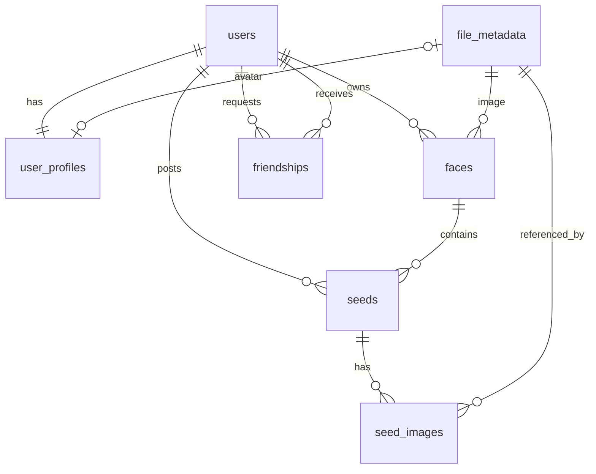

_This project has been created as part of the 42 curriculum by hurabe, nkawaguc, katakada, kharuya._

<!-- ## 2. Description
- プロジェクトの目的(goal)と簡潔な概要を明確に提示する。
- プロジェクトの明確な名前を含める。
- 主要な機能（key features）を含める。 -->

# Description

**MultiFace** は、ユーザーの「多面性」を単位として日々のアクティビティを書き留めるための、個人向けのアクティビティログサービスです。

## 目的

「他者とつながること」を中心に設計されたサービスでは、投稿するほど他者の視線を意識してしまいます。MultiFace はそうしたソーシャルネットワークを目指しておらず、いいね・リプライ・メンションといった反応機能を意図的に持ちません。**自分の好きなことを他人のリアクションを意識せずに書き留めること**自体を目的としたサービスです。

MultiFace では、ユーザーは自分の関心や役割に応じた複数の「**フェイス**（多面性）」を持ち、その時々の内容に合ったフェイスへ投稿します。読書のフェイス、映画のフェイス、日記のフェイス——といった形で、1 つのアカウントの中で文脈を分けて記録できます。

## 主要機能

- **認証**: サインアップ / サインイン / サインアウト / トークンリフレッシュ（JWT + リフレッシュトークン、httpOnly Cookie 保存）
- **フェイス**: 多面性ごとのカテゴリを作成し、公開 / 非公開を設定できる
- **シード（アクティビティ）**: フェイスに紐づく投稿。本文と複数画像およびPDFの添付に対応
- **フレンドシップ**: 申請 / 承認 / ブロック / 解除、フレンド一覧・保留中申請一覧
- **プレゼンス**: ユーザーのオンライン状態の管理と表示
- **ユーザープロフィール**: 表示名・バッジ・アバター画像の管理
- **ファイルストレージ**: 画像のアップロード / ダウンロード / 削除（public / private バケット分離）
- **多言語対応**: 英語・フランス語・日本語の 3 言語（`next-intl`）
- **運用基盤**: Prometheus + Grafana によるメトリクス監視、ELK によるログ可視化

<!-- ## 3. Instructions
- コンパイル・インストール・実行に関する情報を記載する。
- 必要な前提条件をすべて挙げる（ソフトウェア、ツール、バージョン、`.env` 設定などの構成情報）。
- プロジェクトを動かすための手順を段階的に書く。 -->

# Instruction

## 前提条件

| 項目    | バージョン / 条件                                                     |
| ------- | --------------------------------------------------------------------- |
| Docker  | Docker Desktop または OrbStack が起動していること                     |
| VS Code | Dev Containers 拡張が有効であること                                   |
| Node.js | 24（Dev Container 内で提供）                                          |
| pnpm    | 11.16.0（`packageManager` にピン留め済み。corepack 経由で自動有効化） |
| mkcert  | 本番相当環境（local-prod）を動かす場合のみ必要                        |

開発環境の実行は **VS Code Dev Container** を推奨します。本番相当環境のデプロイ操作（docker / mkcert / hosts 変更）は**ホスト OS 側**で実行してください（Dev Container は編集用途です）。

## 環境変数

本リポジトリは環境変数ファイルを使用します。用途ごとに 2 種類あり、いずれも例ファイルをコピーして作成します。

```bash
cp .env.dev.example .env.dev           # 開発環境用
cp .env.example .env                   # 本番相当環境用
```

主な変数は次のとおりです（詳細は各 `.example` ファイルを参照）。

| 変数                                                   | 説明                                                              |
| ------------------------------------------------------ | ----------------------------------------------------------------- |
| `NODE_ENV`                                             | 実行モード（development / production）                            |
| `POSTGRES_DB` / `POSTGRES_USER` / `POSTGRES_PASSWORD`  | PostgreSQL の接続情報                                             |
| `DATABASE_URL`                                         | バックエンド（Drizzle / postgres.js）が使う接続 URL               |
| `RUN_MIGRATIONS`                                       | 起動時にマイグレーションを自動実行するか                          |
| `REDIS_PASSWORD`                                       | Redis の認証パスワード                                            |
| `PEPPER`                                               | パスワードハッシュに付与するペッパー（秘密値）                    |
| `JWT_ISSUER`                                           | JWT の issuer                                                     |
| `ACCESS_TOKEN_EXPIRES_IN` / `REFRESH_TOKEN_EXPIRES_IN` | トークンの有効期限                                                |
| `FILE_STORAGE_BASE_DIR`                                | アップロードファイルの保存先ディレクトリ                          |
| `APP_API_BASE_URL`                                     | BFF（Next.js サーバー）から backend を呼ぶベース URL              |
| `NEXT_PUBLIC_BFF_API_BASE_URL`                         | ブラウザから BFF API を呼ぶベース URL（クライアントに公開される） |
| `GF_SECURITY_ADMIN_PASSWORD` ほか                      | Grafana / Elasticsearch / Kibana / Logstash の設定                |

## 開発環境のセットアップ

1. リポジトリをクローンする
2. 環境変数ファイルを作成する

```bash
cp .env.dev.example .env.dev
```

## 開発環境の起動

1. VS Code でリポジトリを開く
2. **Reopen in Container** を実行する
3. Devコンテナ内のターミナルで次を実行する

```bash
# 開発時の環境変数の反映とJWTの秘密鍵を生成する
pnpm make-env

# データベースのスキーマを反映する
pnpm --filter @tracen/backend db:push
```

- 初回起動時に `postCreateCommand` で `pnpm install` が実行される。
- Dev Container の制御は`.devcontainer/devcontainer.json`で定義されています。
- Dev Container の起動と同時に、`docker-compose.dev.yml` の各サービスが立ち上がります。

  - アプリケーション: `dev-container` / `frontend` / `backend` / `nginx` / `db` / `redis`

- 以下は手動スクリプトにより起動します。
  - 監視: `prometheus` / `grafana` / `alertmanager` と各 exporter（node / cAdvisor / postgres / redis / nginx）
  - ログ可視化（`analytics` プロファイル指定時のみ）: `elasticsearch` / `kibana` / `logstash` / `filebeat`

ルートから直接開発サーバーを起動する場合は次を実行します。

```bash
pnpm dev
```

## 動作確認

| 用途                              | URL                           |
| --------------------------------- | ----------------------------- |
| ブラウザ入口（Nginx 経由）        | http://localhost:8080         |
| Next.js 直アクセス（デバッグ用）  | http://localhost:3000         |
| Hono API 直アクセス（デバッグ用） | http://localhost:8000/api/v1/ |
| BFF API                           | http://localhost:8080/api/    |
| PostgreSQL                        | localhost:5432                |
| Redis                             | localhost:6379                |
| Grafana                           | http://localhost:3001         |
| Prometheus                        | http://localhost:9090         |
| Alertmanager                      | http://localhost:9093         |
| Kibana（analytics プロファイル）  | http://localhost:8080/kibana  |

Nginx は `/api/*` と `/*` をいずれも `frontend:3000` に転送し、必要に応じて BFF が `backend:8000` を呼び出します。

## 本番相当環境（local-prod）のセットアップ

### 前提：

- mkcert がインストールされていること
- リポジトリをクローンしていること

### 手順 1: hosts を設定

ホスト OS の `/etc/hosts` に以下を追加します。

```
127.0.0.1 tracen.local registry.tracen.local api.tracen.local kibana.tracen.local
```

### 手順 2: 環境変数ファイルを作成する

```bash
cp .env.example .env
```

### 手順 3: TLS 資材を生成

```bash
bash scripts/setup-local-prod-tls.sh
```

### 手順 4: Docker にローカルレジストリの CA を信頼させる

```bash
sudo mkdir -p /etc/docker/certs.d/registry.tracen.local:5000
sudo cp containers/infra/local-prod/certs/ca.crt /etc/docker/certs.d/registry.tracen.local:5000/ca.crt
```

## 本番相当環境（local-prod）の実行

ローカル PC 上で、ビルド済みイメージ + ローカルレジストリ + HTTPS という本番相当構成を 1 コマンドで起動します。

環境によっては Docker の再起動が必要です。

### デプロイ

```bash
# frontend / backend + monitoring のみを起動する場合は
bash scripts/deploy-local-prod.sh

# analyticを含めた全コンテナを起動する場合は
WITH_ANALYTICS=1 bash scripts/deploy-local-prod.sh
```

- 入口: https://tracen.local
- BFF API: https://tracen.local/api/
- backend API: https://api.tracen.local/api/v1/
- monitoring: https://tracen.local/grafana
- analytics: https://kibana.tracen.local

## 停止とクリーンアップ

```bash
# 開発環境
docker compose -f docker-compose.dev.yml down

# 本番相当環境
bash scripts/down-local-prod.sh
```

<!-- ## 4. Resources
- テーマに関連する定番の参考資料を列挙する（ドキュメント、記事、チュートリアル等）。
- AI をどのように使ったかの説明を含める。どのタスクに、プロジェクトのどの部分に使ったかを明示する。 -->

# Resources

## 参考資料

### サービスコンセプト

- 見るより気兼ねなく書く、Trickle というサービス
- Trickle の機能紹介（アクティビティログサービス）
- 見る・話すより、書くこと自体を楽しむサービス「Trickle」

### 技術ドキュメント

- [Next.js 公式ドキュメント](https://nextjs.org/docs)
- [Hono 公式ドキュメント](https://hono.dev/docs/)
- [Drizzle ORM 公式ドキュメント](https://orm.drizzle.team/docs/overview)
- [PostgreSQL 公式ドキュメント](https://www.postgresql.org/docs/)
- [Redis 公式ドキュメント](https://redis.io/documentation/)
- [Nginx 公式ドキュメント（リバースプロキシ・TLS 設定ドキュメント）](https://nginx.org/en/docs/http/ngx_http_proxy_module.html)
- [Prometheus 公式ドキュメント](https://prometheus.io/docs/)
- [Grafana 公式ドキュメント](https://grafana.com/docs/)
- [Alertmanager 公式ドキュメント](https://prometheus.io/docs/alerting/latest/alertmanager/)
- [Elasticsearch公式ドキュメント](https://www.elastic.co/guide/index.html)
- [Logstash 公式ドキュメント](https://www.elastic.co/docs/reference/logstash)
- [Kibana 公式ドキュメント](https://www.elastic.co/docs/reference/kibana)
- [Filebeat 公式ドキュメント](https://www.elastic.co/docs/reference/beats/filebeat)
- [mkcert リポジトリ（ローカル CA によるローカル HTTPS）](https://github.com/FiloSottile/mkcert)

### プロジェクト内ドキュメント

| ドキュメント                                   | 内容                                                              |
| ---------------------------------------------- | ----------------------------------------------------------------- |
| `docs/DEVELOPMENT.md`                          | 開発環境手順                                                      |
| `docs/architecture/ARCHITECTURE.md`            | プロジェクト全体アーキテクチャ                                    |
| `docs/contracts/CONTRACTS_GUIDE.md`            | 共有型・スキーマの運用ガイド                                      |
| `docs/deploy/LOCAL_PROD_DEPLOYMENT.md`         | 本番相当環境のデプロイ手順                                        |
| `docs/test/LOCAL_CI_LOCAL_PROD.md`             | ローカル CI の実行方法                                            |
| `docs/for_dev/EDITORCONFIG_SETUP.md`           | EditorConfig の設定                                               |
| `docs/for_dev/GIT_HOOKS_LOCAL_VALIDATION.md`   | Git hooks によるローカルバリデーション                            |
| `docs/for_dev/LINTER_SETUP.md`                 | Linter (ESLint) の設定                                            |
| `docs/for_dev/PRETTIER_SETUP.md`               | Prettier の設定                                                   |
| `docs/for_dev/SECURITY_EXCEPTION_3DAY_RULE.md` | セキュリティ例外運用ルール                                        |
| `docs/api/backend/api-key-openapi.yaml`        | バックエンド API 仕様（API キー認証・管理者用）                   |
| `docs/api/backend/jwt-auth-openapi.yaml`       | バックエンド API 仕様（JWT アクセストークン認証・一般ユーザー用） |
| `docs/api/backend/public-openapi.yaml`         | バックエンド API 仕様（認証不要・公開 API）                       |

## AI の利用について

本プロジェクトでは、開発補助として生成 AI（Claude Code / GitHub Copilot）を継続的に利用しました。

### AI を使ったタスク

| 対象             | 使い方                                                                                                                       |
| ---------------- | ---------------------------------------------------------------------------------------------------------------------------- |
| Issue 起票       | `.claude/skills/github-create-issue`、`.github/agents/issue-creator.agent.md` によりテンプレートに沿った Issue を作成        |
| 実装補助         | `.claude/skills/github-impl-issue`、`.github/agents/issue-implementer.agent.md` により Issue 単位で実装を進行                |
| コミット / PR    | `.claude/skills/github-commit`、`.claude/skills/github-make-pr`、`.github/skills/*` によりコミットメッセージと PR 記述を統一 |
| 技術調査         | `.claude/skills/web-search` により外部情報を調査                                                                             |
| ドキュメント作成 | `docs/` 配下の設計・手順ドキュメントの草案作成とレビュー                                                                     |

### 人が判断した領域

- アーキテクチャの最終決定、モジュール選定、DB スキーマの確定
- セキュリティ・認証・シークレットに関わる変更の可否判断
- 依存パッケージの脆弱性対応方針（例外運用を含む）

<!-- ## 5. Team Information
README 冒頭に挙げた各チームメンバーについて、以下を書く。
- 割り当てられた役割（PO、PM、Tech Lead、Developers 等）
- その責務の簡潔な説明 -->

# Team Information

- hurabe (PM+Developers)
- nkawaguc (PO+Developers): サービスコンセプトの立案、プロダクト方向性の決定、モニタリング基盤実装
- katakada (Tech Lead+Developers): アーキテクチャ設計、技術選定、CI パイプライン設計、開発環境構築、バックエンド実装
- kharuya (Developers): フロントエンド/BFF実装

<!-- ## 6. Project Management
- チームがどのように作業を組織したか（タスク分担、ミーティング等）
- プロジェクト管理に使ったツール（GitHub Issues、Trello 等）
- 使用したコミュニケーションチャネル（Discord、Slack 等） -->

# Project Management

## タスク管理

タスクはすべて **GitHub Issues** で管理しました。起票の粒度と記述内容を揃えるため、空の Issue を禁止（`blank_issues_enabled: false`）し、次の 6 種類のテンプレートを用意しています。

- `bug_report`（不具合報告）
- `feature_request`（機能追加）
- `documentation`（ドキュメント）
- `performance`（性能改善）
- `refactor`（リファクタリング）
- `ui_ux_improvement`（UI / UX 改善）

作業は「Issue 起票 → ブランチ作成 → 実装 → PR → レビュー → マージ」の流れで進め、Issue 単位で担当を割り当てました。

## ラベル運用

Issue には接頭辞付きのラベルを付与し、「どこの領域を」「どの優先度で」「どの規模で」やるのかを一目で判別できるようにしました。これにより、担当の割り振りと着手順の判断をラベルの絞り込みだけで行えます。

| カテゴリ | ラベル                                                                                                   | 用途                                     |
| -------- | -------------------------------------------------------------------------------------------------------- | ---------------------------------------- |
| 領域     | `area:frontend` / `area:backend` / `area:contracts` / `area:db` / `area:infra` / `area:ci` / `area:docs` | 変更が及ぶレイヤーを示す                 |
| 優先度   | `priority:p0` 〜 `priority:p3`                                                                           | 着手順の判断                             |
| 規模     | `size:XS` / `size:S` / `size:M` / `size:L`                                                               | 見積もりと分割の目安                     |
| 課題対応 | `mandatory` / `module:major` / `module:minor`                                                            | 必須要件とモジュールの対応付け           |
| その他   | `epic` / `type:design` / `onboarding` / `question`                                                       | 大きなまとまり、設計検討、環境構築、質問 |

## コミュニケーション

- **Discord**: 日常的な相談・進捗共有。監視基盤の Alertmanager からのアラートも Discord に通知される
- **ドキュメント**: 決定事項や手順は口頭で終わらせず `docs/` 配下に残す運用

## 品質ゲート

CI サーバーではなく、**Git hooks とローカル CI** で品質を担保しています。

| タイミング   | 実行内容                                                                                                          |
| ------------ | ----------------------------------------------------------------------------------------------------------------- |
| `pre-commit` | `lint-staged`（ESLint + Prettier）、`pnpm audit`、`secrets:scan`（gitleaks）、`osv:scan-lockfiles`（OSV-Scanner） |
| `pre-push`   | `pnpm typecheck`、`pnpm local-ci:fast`（本番相当環境のビルド・起動・スモークテスト・後片付け）                    |
| 任意         | `pnpm local-ci:full`（本番相当レジストリを含めた起動検証）                                                        |

ローカル CI は `docker-compose.local-prod.yml` を実際に起動し、`https://tracen.local/api/health` とテストスクリプト実行および、トップページの疎通までを確認します。これにより、開発中の変更が本番相当のデプロイを壊していないかを早期に検知できます。

## セキュリティ運用

- 依存パッケージの脆弱性は `pnpm audit` と OSV-Scanner で検出し、`pnpm-workspace.yaml` の `overrides` で安全なバージョンに固定
- 直ちに解消できない脆弱性は、期限を区切って扱う運用ルール（`docs/for_dev/SECURITY_EXCEPTION_3DAY_RULE.md`）を定義
- コミット前に gitleaks でシークレットの混入を検査

<!-- ## 7. Technical Stack
- 使用したフロントエンドの技術・フレームワーク
- 使用したバックエンドの技術・フレームワーク
- データベースシステムと、それを選んだ理由
- その他の重要な技術・ライブラリ
- 主要な技術的選択の正当化s-->

# Technical Stack

## 構成図

```
ブラウザ
  │  HTTP（開発） / HTTPS（本番相当）
  ▼
Nginx（リバースプロキシ）
  │
  ▼
frontend-bff（Next.js）
  - React Server / Client Components
  - Server Actions / Route Handlers
  - server/usecases + repositories
  │  Hono RPC（サーバー間のみ）
  ▼
backend（Hono）
  ├─▶ PostgreSQL
  └─▶ Redis
```

## 採用技術

| レイヤー                | 技術                                                                                   |
| ----------------------- | -------------------------------------------------------------------------------------- |
| フロントエンド / BFF    | Next.js、React、Tailwind CSS、next-intl、react-hook-form、Zod、lucide-react、Storybook |
| バックエンド            | Hono、Vite                                                                             |
| 型・スキーマ共有        | @tracen/contracts（Zod スキーマ）、Hono RPC クライアント（hc）                         |
| データベース            | PostgreSQL、Drizzle ORM、postgres.js、drizzle-kit                                      |
| キャッシュ / 短命データ | Redis（ioredis）                                                                       |
| 認証                    | argon2（+ ペッパー）、JWT、JWKS 公開エンドポイント、jose                               |
| リバースプロキシ        | Nginx（開発: HTTP、本番相当: HTTPS + upstream 証明書検証）                             |
| 監視                    | Prometheus、Grafana、Alertmanager、各種 exporter                                       |
| ログ可視化              | Elasticsearch、Logstash、Kibana、Filebeat                                              |
| テスト                  | Vitest、シェルスクリプトによる API テスト、local-prod スモークテスト                   |
| 開発環境                | Docker Compose、Dev Container、pnpm、ローカル Docker レジストリ、mkcert                |
| 品質管理                | ESLint、Prettier、EditorConfig、husky、lint-staged、gitleaks、OSV-Scanner              |

## 技術選定の理由

### モノレポ + 共有スキーマパッケージ

フロントエンドとバックエンドで API の型がずれることを、レビューではなく仕組みで防ぎたいという理由から、pnpm workspaces のモノレポ構成を採用しました。リクエスト / レスポンスの形は `@tracen/contracts` に Zod スキーマとして 1 か所で定義し、バックエンドは実行時バリデーションに、フロントエンドは型とフォーム検証に同じ定義を使います。契約を変更すると、両側で型エラーとして即座に検出されます。

### BFF パターン（Next.js）

ブラウザからバックエンド API を直接叩かせず、Next.js のサーバー側（Route Handler / Server Actions / usecases）を必ず経由させる構成にしました。これにより、アクセストークンを httpOnly Cookie に閉じ込めたまま扱え、画面都合のデータ整形をバックエンドの API 設計に持ち込まずに済みます。バックエンドAPIは本番相当構成では外部へ非公開にすることもできます（課題モジュール実装のため、バックエンドAPIも一時的に公開しています）。

### Hono

バックエンドには軽量かつ高速で、TypeScript との親和性が高い Hono を採用しました。決め手は **RPC 機能**で、ルーター定義からクライアント側の型が導出されるため、BFF からの呼び出しがエンドポイント単位で型安全になります。Zod バリデータとの統合により、契約パッケージのスキーマをそのまま入力検証に使える点も選定理由です。

### PostgreSQL

宣言的に表現でき、外部キーのカスケード削除まで DB 側で保証できるリレーショナルデータベースが適切と判断しました。その中で、列挙型・部分インデックス・JSON 型などの機能が充実し、Docker での運用実績も豊富な PostgreSQL を選定しています。

### Drizzle ORM

スキーマを TypeScript で定義し、そこから型とマイグレーションの両方を生成できる点を評価しました。SQL に近い記述のままクエリ結果の型が付き、独自形式のファイルを使用しないため、余計な抽象化レイヤーが少なく、バンドルサイズも小さくなるため、コードの透過性が高くなる点も採用理由です。

### Redis

プレゼンス（オンライン状態）とリフレッシュトークンは、頻繁に更新され、かつ TTL による自動失効が前提となるデータです。これらを PostgreSQL に持たせると書き込み負荷と不要な永続化が増えるため、TTL を標準機能として持つ Redis に分離しました。

### argon2 + ペッパー

DB 漏洩時の被害を抑えるために、環境変数から注入するペッパー（シークレットなソルト）を使用した上で、パスワードのハッシュ化には、**IETF（RFC 9106）** でも公式に推奨されている、メモリハードな（ハッシュ計算時に、意図的に一定量の物理メモリ（RAM）を占有する）設計で GPU による並列総当たり攻撃に強い argon2 を採用しました。

### JWT (JSON Web Token) + JWKS (JSON Web Key Set)

ステートレスな実装を実現するために、認証にはJWTをアクセストークン（短命）として採用し、かつ、トークン漏洩・不正利用時の被害リスクを軽減するために、リフレッシュトークン（長命・失効管理あり）と併用する方針にしました。また、トークン検証のための認証サーバーへのアクセスを軽減するために、公開鍵のJWKSを `/.well-known/jwks.json` で配布する構成を採用し、検証側での独立したトークン検証を可能にしました。将来サービスを分割した場合にも同じ仕組みを流用できる拡張性が高い点も採用理由です。

### 監視・ログ基盤を分離した構成

アプリケーション本体を改修せずに可観測性を確保するため、メトリクスは各サービスの exporter を Prometheus が収集し、ログはコンテナの標準出力を Filebeat が収集する構成にしました。アプリ側は「決まった形の JSON を標準出力に出す」だけでよく、収集基盤と疎結合に保てます。

<!-- ## 8. Database Schema
- データベース構造の視覚的な表現、または記述
- テーブル／コレクションと、それらの関係
- 主要なフィールドとデータ型 -->

# Database Schema

## ER 図



## テーブル定義

### users

| カラム          | 型        | 制約・説明                                        |
| --------------- | --------- | ------------------------------------------------- |
| `id`            | uuid      | 主キー ・ ID                                      |
| `email`         | text      | NOT NULL / ユニークインデックス ・ メールアドレス |
| `name`          | text      | NOT NULL ・ 登録名                                |
| `password_hash` | text      | NOT NULL ・ パスワードハッシュ                    |
| `created_at`    | timestamp | NOT NULL ・ 作成日時                              |

### user_profiles

| カラム           | 型        | 制約・説明                                                                   |
| ---------------- | --------- | ---------------------------------------------------------------------------- |
| `id`             | uuid      | 主キー ・ ID                                                                 |
| `name`           | text      | NOT NULL ・ 表示名                                                           |
| `badge`          | text      | バッジ絵文字                                                                 |
| `avatar_file_id` | uuid      | `file_metadata.id` 参照（ユニーク、削除時 SET NULL） ・ avatar画像ファイルID |
| `user_id`        | uuid      | NOT NULL / `users.id` 参照（ユニーク、削除時 CASCADE） ・ ユーザーID         |
| `created_at`     | timestamp | NOT NULL ・ 作成日時                                                         |
| `updated_at`     | timestamp | NOT NULL ・ 更新日時                                                         |

### file_metadata

| カラム        | 型           | 制約・説明                                    |
| ------------- | ------------ | --------------------------------------------- |
| `id`          | uuid         | 主キー ・ ID                                  |
| `owner_id`    | uuid         | NOT NULL ・ 所有者ID（ユーザーID）            |
| `bucket`      | varchar(63)  | NOT NULL ・ バケット名                        |
| `storage_key` | varchar(512) | NOT NULL / ユニーク ・ ストレージ内の相対パス |
| `file_name`   | varchar(255) | NOT NULL ・ アップロード時の元ファイル名      |
| `mime_type`   | varchar(100) | NOT NULL ・ Content-Type                      |
| `file_size`   | integer      | NOT NULL ・ ファイルサイズ                    |
| `created_at`  | timestamp    | NOT NULL ・ 作成日時                          |
| `updated_at`  | timestamp    | NOT NULL ・ 更新日時                          |

### faces

| カラム        | 型        | 制約・説明                                                       |
| ------------- | --------- | ---------------------------------------------------------------- |
| `id`          | uuid      | 主キー ・ ID                                                     |
| `user_id`     | uuid      | NOT NULL / `users.id` 参照（削除時 CASCADE） ・ ユーザーID       |
| `name`        | text      | NOT NULL ・ フェイス名                                           |
| `emoji`       | text      | フェイスの絵文字                                                 |
| `description` | text      | フェイスの説明                                                   |
| `image_id`    | uuid      | `file_metadata.id` 参照（削除時 SET NULL） ・ face画像ファイルID |
| `visibility`  | enum      | NOT NULL ・ 公開範囲ステータス                                   |
| `created_at`  | timestamp | NOT NULL ・ 作成日時                                             |
| `updated_at`  | timestamp | NOT NULL ・ 更新日時                                             |

インデックス: `idx_faces_user_id`（自分のフェイス一覧の取得用）

### seeds

| カラム       | 型        | 制約・説明                                                 |
| ------------ | --------- | ---------------------------------------------------------- |
| `id`         | uuid      | 主キー ・ ID                                               |
| `user_id`    | uuid      | NOT NULL / `users.id` 参照（削除時 CASCADE） ・ ユーザーID |
| `face_id`    | uuid      | NOT NULL / `faces.id` 参照（削除時 CASCADE） ・ フェイスID |
| `body`       | text      | NOT NULL ・ 本文                                           |
| `created_at` | timestamp | NOT NULL ・ 作成日時                                       |
| `updated_at` | timestamp | NOT NULL ・ 更新日時                                       |

インデックス: `idx_seeds_user_id`（ユーザーのシード一覧の取得用）、`idx_seeds_face_id`（フェイスのシード一覧の取得用）

### seed_images

シードと画像の多対多を表現する中間テーブルです。

| カラム          | 型      | 制約・説明                                                                 |
| --------------- | ------- | -------------------------------------------------------------------------- |
| `seed_id`       | uuid    | NOT NULL / `seeds.id` 参照（削除時 CASCADE） ・ シードID                   |
| `image_id`      | uuid    | NOT NULL / `file_metadata.id` 参照（削除時 CASCADE） ・ seed画像ファイルID |
| `display_order` | integer | NOT NULL ・ 表示順インデックス                                             |

制約: `(seed_id, image_id)` の複合主キー、`(seed_id, display_order)` のユニーク制約

インデックス: `idx_seed_images_image_id`（image_idによる逆引き用）

### friendships

| カラム         | 型          | 制約・説明                                                             |
| -------------- | ----------- | ---------------------------------------------------------------------- |
| `id`           | uuid        | 主キー ・ ID                                                           |
| `requester_id` | uuid        | NOT NULL / `users.id` 参照（削除時 CASCADE） ・ 申請者（ユーザーID）   |
| `addressee_id` | uuid        | NOT NULL / `users.id` 参照（削除時 CASCADE） ・ 被申請者（ユーザーID） |
| `status`       | enum        | NOT NULL ・ フレンド関係ステータス                                     |
| `created_at`   | timestamptz | NOT NULL ・ 作成日時                                                   |
| `updated_at`   | timestamptz | NOT NULL ・ 更新日時                                                   |

制約: `(requester_id, addressee_id)` のユニーク制約（重複申請防止）

インデックス：`(idx_friendships_requester_status)`（自分が申請したデータの検索用）、`(idx_friendships_addressee_status)`（自分宛の申請の検索用）

## マイグレーション

スキーマは Drizzle ORM の TypeScript 定義を正とし、`drizzle-kit` で生成した SQL マイグレーション（`containers/apps/backend/drizzle/`）で適用します。`RUN_MIGRATIONS=true` の場合、バックエンド起動時に自動適用されます。

<!-- ## 9. Features List
- 実装した機能の完全なリスト
- 各機能を担当したチームメンバー
- 各機能の動作の簡潔な説明 -->

# Features List

## 認証・アカウント

| 機能                 | 概要                                                                                          | 担当               |
| -------------------- | --------------------------------------------------------------------------------------------- | ------------------ |
| サインアップ         | メールアドレス・パスワードによる登録。argon2 + ペッパーでハッシュ化し、プロフィールを同時作成 | katakada / kharuya |
| サインイン           | 認証成功時にアクセストークンとリフレッシュトークンを発行し、httpOnly Cookie に保存            | katakada / kharuya |
| サインアウト         | リフレッシュトークンを失効させ、Cookie を破棄                                                 | katakada / kharuya |
| トークンリフレッシュ | リフレッシュトークンによるアクセストークンの再発行                                            | katakada / kharuya |
| JWKS 公開            | `/.well-known/jwks.json` で検証用公開鍵を配布                                                 | katakada           |

## プロフィール・ユーザー

| 機能                   | 概要                                     | 担当               |
| ---------------------- | ---------------------------------------- | ------------------ |
| プロフィール取得・更新 | 表示名・バッジ・アバターの参照と更新     | katakada / kharuya |
| プロフィール一括取得   | 複数ユーザーのプロフィールをまとめて取得 | katakada / kharuya |
| ユーザー管理 API       | ユーザーの作成・取得・削除               | katakada           |
| プレゼンス             | オンライン状態の記録と参照               | katakada           |

## フェイス・シード（投稿）

| 機能                     | 概要                                           | 担当               |
| ------------------------ | ---------------------------------------------- | ------------------ |
| フェイス作成・一覧・詳細 | 多面性ごとのカテゴリを作成し、一覧・詳細を表示 | katakada / kharuya |
| シード投稿               | フェイスに紐づく本文の投稿                     | katakada / kharuya |
| シードへの画像添付       | 複数画像を表示順つきで添付                     | katakada / kharuya |
| シード詳細表示           | 個別シードの詳細ページと BFF 経由の取得 API    | katakada / kharuya |

## フレンドシップ

| 機能             | 概要                               | 担当               |
| ---------------- | ---------------------------------- | ------------------ |
| フレンド申請     | 対象ユーザーへの申請作成           | katakada / kharuya |
| 申請の承認・拒否 | 受け取った申請のステータス更新     | katakada / kharuya |
| ブロック         | 対象ユーザーのブロック             | katakada / kharuya |
| フレンド解除     | 成立済み関係の削除                 | katakada / kharuya |
| フレンド一覧     | 成立済みフレンドの一覧表示         | katakada / kharuya |
| 保留中申請一覧   | 自分宛て・自分発の保留中申請の一覧 | katakada / kharuya |

## ファイルストレージ

| 機能         | 概要                                 | 担当               |
| ------------ | ------------------------------------ | ------------------ |
| アップロード | ファイルを保存し、メタデータを登録   | katakada / kharuya |
| ダウンロード | 所有者・公開範囲を確認したうえで配信 | katakada / kharuya |
| 削除         | 実体とメタデータの削除               | katakada / kharuya |
| 静的配信     | public バケットの静的ファイル配信    | katakada           |

## 画面・UX

| 機能                           | 概要                                                        | 担当     |
| ------------------------------ | ----------------------------------------------------------- | -------- |
| ホーム                         | 自分のアクティビティ一覧                                    | kharuya  |
| フレンド                       | 一覧画面                                                    | kharuya  |
| プロフィール画面               | ユーザーごとのプロフィール表示                              | kharuya  |
| 設定画面                       | ユーザー設定                                                | kharuya  |
| 利用規約・プライバシーポリシー | 静的ページ（多言語対応）                                    | nkawaguc |
| 多言語対応                     | 英語・フランス語・日本語。`[locale]` ルーティングで切り替え | kharuya  |
| コンポーネントカタログ         | Storybook による UI コンポーネントの確認                    | kharuya  |

## 運用・基盤

| 機能             | 概要                                                                           | 担当     |
| ---------------- | ------------------------------------------------------------------------------ | -------- |
| ヘルスチェック   | `/api/health`（BFF 経由で backend まで確認）、`/health/redis`                  | katakada |
| メトリクス監視   | Prometheus + Grafana によるホスト・コンテナ・PostgreSQL・Redis・Nginx の可視化 | nkawaguc |
| アラート通知     | Alertmanager から Discord への通知                                             | nkawaguc |
| ログ可視化       | Filebeat → Logstash → Elasticsearch → Kibana のパイプライン                    | hurabe   |
| 本番相当デプロイ | ローカルレジストリ + HTTPS 構成への 1 コマンドデプロイ                         | katakada |
| ローカル CI      | 本番相当環境のビルド・起動・スモークテスト・後片付けの自動実行                 | katakada |

## 既知の制限

- 動画の添付には対応していません。
- CI は GitHub Actions ではなく、ローカル CI と Git hooks で実行しています。

<!-- ## 10. Modules
- 選択した全モジュールのリスト（Major / Minor）
- 点数計算（Major = 2pts、Minor = 1pt）
- 各モジュール選択の正当化。特に custom の "Modules of choice" について。
- 各モジュールをどのように実装したか
- 各モジュールを担当したチームメンバー -->

# Modules

8個のMajor moduleと6個のMinor moduleを実装しました。点数は合計で22点です。

## 1 Web

### Major: Use a framework for both the frontend and backend.

- 担当: kharuya, katakada

* **選定理由 (Justification):**
  フロントエンドとバックエンドのAPIスキーマを仕組みとして同期させ、堅牢かつ型安全なフルスタック開発を可能にするため。
* **具体的な実装方法 (Implementation):**
  - **フロントエンド / BFF (Bridges to Frontend):** **Next.js 16 (App Router)** を採用。ブラウザから直接バックエンドAPIを呼ばせず、Next.jsのサーバー側（Route Handlers / Server Actions）を必ず経由させるBFFパターンを構築。これにより、アクセストークンを httpOnly Cookie に閉じ込めた安全な通信を実現。
  - **バックエンド:** 超軽量かつ TypeScript フレンドリーな **Hono 4** を採用。
  - **型・スキーマ共有:** `pnpm workspaces` によるモノレポ構成を活かし、共有パッケージ `@tracen/contracts` 内に Zod スキーマを一元定義。Hono ルーター定義からクライアント側の型が導出される **Hono RPC 機能**を活用することで、BFFからバックエンドの通信エンドポイント単位で完全な型安全性を確保。

### Major: A public API to interact with the database with a secured API key, rate limiting, documentation, and at least 5 endpoints:

- 担当: katakada

* **選定理由 (Justification):**
  BFFサーバーやサードパーティの開発者から、ブラウザを介さずに安全、かつ管理された方法でデータベース内のデータ（ユーザー認証・CRUD）を操作できるようにするため。
* **具体的な実装方法 (Implementation):**
  - **安全なAPIキー (Secured API Key):** ローカルの `.env` で注入される安全な管理者/サードパーティ用APIキー（`MASTER_API_KEY`）をリクエストヘッダー（例: `X-API-Key`）を介して安全に検証する認証ロジックをバックエンド側に実装。
  - **レートリミット (Rate Limiting):** 環境変数 `MASTER_API_KEY_RATE_LIMIT` を用いたレートリミット保護を適用し、DDoS攻撃や不正な過剰アクセスからデータベースおよびバックエンドAPIを防御。
  - **ドキュメンテーション (Documentation):** OpenAPI（Swagger）フォーマットに準拠した詳細なAPI仕様書を `docs/api/backend/api-key-openapi.yaml` に定義し、提供。
  - **5つのエンドポイント (At least 5 endpoints):** データベースに対するCRUD処理や登録認証を含む、以下の5つ以上の実質的なデータベース操作用エンドポイントを提供。
    - `POST /api/v1/auth/sign-up`（ユーザーの登録・作成）
    - `POST /api/v1/auth/sign-in`（ユーザーの認証取得）
    - `POST /api/v1/auth/refresh`（JWTおよびリフレッシュトークンの再発行）
    - `GET /api/v1/admin/users/{id}`（管理者用 ユーザー詳細取得）
    - `PUT /api/v1/admin/users/{id}`（管理者用 ユーザー情報更新）
    - `DELETE /api/v1/admin/users/{id}`（管理者用 ユーザー情報削除）

### Minor: Use an ORM for the database.

- 担当: katakada

* **選定理由 (Justification):**
  データベーススキーマを TypeScript のコードを正（Single Source of Truth）として宣言的に定義し、安全な型推論を伴う型安全なSQLクエリの発行と、スキーマ整合性を維持する自動マイグレーションを両立するため。
* **具体的な実装方法 (Implementation):**
  - TypeScript ファーストな **Drizzle ORM** と PostgreSQL クライアントライブラリとして **postgres.js** を採用。
  - `drizzle-kit` を使用して、TypeScript のスキーマ定義から直接 SQL マイグレーションファイル（`containers/apps/backend/drizzle/` 配下）を自動生成。
  - `docker-compose.local-prod.yml` において `RUN_MIGRATIONS=true` を指定することで、コンテナ起動時にマイグレーションスクリプトが自動的に走り、データベーススキーマの同期適用（作成・更新）を行う強固な自動適用システムを構築。

### Minor: Server-Side Rendering (SSR) for improved performance and SEO.

- 担当: kharuya

* **選定理由 (Justification):**
  SPA（Single Page Application）で発生しがちな、クライアント側での初期データフェッチ待ちによる「画面のチラつき（Flicker）」や「未認証画面の一瞬のレンダリング（セッション漏洩）」をサーバーサイドでセキュアにブロックし、FCP（First Contentful Paint／起動時の表示速度）の向上とSEO（検索エンジン最適化）を最大化するため。
* **具体的な実装方法 (Implementation):**
  - **Next.js App Router (Next.js 16 / React 19)** の **React Server Components (RSC)** を採用。ユーザープロフィール、設定画面、フェイス・シード（投稿）一覧などの主要ページをサーバー側でプリレンダリング（SSR）して配信。
  - **BFF (Bridges to Frontend) パターン**を構成し、ブラウザからバックエンドAPIを直接叩かせず、Next.jsのサーバー側（Route Handlers / Server Actions）を経由する構成を徹底。サーバー側でセッションCookie（`httpOnly`）から安全にJWTアクセストークンを抽出し、バックエンド（Hono:8000）のAPIをサーバー間通信で高速に呼び出して初期データを結合した上で、完全なHTMLとしてクライアントに即座に提供。

### Minor: Custom-made design system with reusable components, including a proper color palette, typography, and icons (minimum: 10 reusable components).

- 担当: kharuya

* **選定理由 (Justification):**
  「他者のリアクションを意識せず、複数のフェイス（多面性）に自分の関心事を書き留める」という MultiFace のトーン＆マナーに調和した一貫性のあるブランド体験（配色、タイポグラフィ、アイコン）を提供し、UIコードの重複を減らしてフロントエンドの品質と保守性を高めるため。
* **具体的な実装方法 (Implementation):**
  - **Tailwind CSS 4** と **lucide-react** をベースに構築した、完全独自のオリジナルデザインシステム。
  - 以下の**10個以上の再利用可能コンポーネント（Reusable Components）**を独自に実装。
    1.  `Button`: 動的なバリアント（Primary/Secondary/Danger）とサイズ調整が可能な基本ボタン。
    2.  `Input`: クライアント側のフォームバリデーション（`react-hook-form` / `Zod`）に完全連動したテキスト入力フィールド。
    3.  `Avatar`: ユーザー設定に応じた画像の表示、および画像未設定時のデフォルトフォールバック機能。
    4.  `Badge`: ユーザーバッジ、接続状態、または投稿のメタデータ表示用ミニバッジ。
    5.  `Dialog / Modal`: 共通のアラートや確認、フェイス新規作成時などに用いるモーダルポップアップ。
    6.  `Card / FaceCard`: フェイス情報（フェイス名、絵文字、説明、公開状態）を一貫したスタイルで囲む表示カード。
    7.  `SeedCard`: 本文、複数画像のグリッド配置、および削除アクションを内包した投稿コンポーネント。
    8.  `Tabs`: 画面遷移を伴わず、プロフィールの表示やコンテンツ一覧をスマートに切り替える切り替えタブ。
    9.  `Spinner / Loading`: APIレスポンス待ち時のアニメーションインジケータ。
    10. `LanguageSelector`: next-intl と連携してシームレスに多言語（英語、日本語、フランス語）を切り替えるドロップダウン。
  - すべてのコンポーネントは **Storybook 8** によってコンポーネントカタログ化されており、ビジュアル確認と挙動の保証を容易にしている。

### Minor: Implement advanced search functionality with filters, sorting, and pagination.

- 担当: kharuya, katakada

* **選定理由 (Justification):**
  ユーザーのフェイス、シード（投稿）、およびフレンドシップのデータ量が増加した際にも、データベースに不必要なクエリ負荷をかけることなく、ユーザーが目的のデータへ瞬時に到達できる優れたUXを提供するため。
* **具体的な実装方法 (Implementation):**
  - **データベース最適化 & クエリ設計:** PostgreSQL上に適切にインデックス（`idx_seeds_face_id`, `idx_seeds_user_id`）を設計。Honoのバックエンドにおいて、Drizzle ORMの `where`、`limit`、`offset`、および `orderBy` を用いた高速でメモリ効率の良い参照処理を実装。
  - **フィルター機能:** 特定の「フェイス（face_id）」への絞り込みや、公開・非公開（`visibility`）の認可状態に応じた表示制限フィルター。
  - **ソート機能:** 投稿日（`created_at`）の最新順・最古順、および `display_order`（シード画像の並び順）に沿った動的な並び替えソート。
  - **ページネーション:** Next.jsフロントエンドのURLクエリパラメータ（URLSearchParams）と連動したステートレスなページネーションシステムを実装。一定件数（例: 10件）ずつ段階的にデータをフェッチ・レンダリングすることで、初回読み込み時のネットワーク帯域と初期描画コストを劇的に最適化。

### Minor: File upload and management system.

- 担当: kharuya, katakada

* **選定理由 (Justification):**
  ユーザーが複数の画像をシード（投稿）に添付したり、アカウントごとに固有のアバター画像をセキュアにアップロード・管理できるようにするため。
* **具体的な実装方法 (Implementation):**
  - **バリデーション:** フロントエンド（BFF）とバックエンドの双方で、ファイルサイズ（例: 5MB）や MIME タイプ（MIME検知による画像形式の制限）の安全な検証を強制。
  - **メタデータ管理 & 永続化:** アップロードされたファイルのメタデータ（ bucket, storage_key, file_name, file_size, owner_id 等）は `file_metadata` テーブルに PostgreSQL 上で記録され、実ファイルはホストにマウントされた永続ボリューム `file_storage_data`（`FILE_STORAGE_BASE_DIR`）に安全に保管されます。
  - **バケット分離 (Access Control):** AWS S3ライクな概念のバケット設計を構築し、ログイン不要でアクセス可能な公開バケット（`public-bucket`）と、JWTトークンの所有者（認可）を確認した上でのみファイル配信を行う非公開バケット（`private-bucket`）を実装。
  - **機能の網羅:** クライアント側でのアップロード進捗インジケータ（Progress Indicator）、プレビュー表示、多対多の中間テーブル `seed_images` によるシード投稿と紐付いた画像の削除機能を完全に網羅。

## 2 Accessibility and Internationalization

### Minor: Support for multiple languages (at least 3 languages).

- 担当: kharuya, nkawaguc

* **選定理由 (Justification):**
  MultiFace は日本語話者以外のユーザーも想定しており、UI 文言をハードコードすると後から多言語化する際に user-facing text の洗い出しから始める必要が生じる。開発初期から `next-intl` を導入し、コンポーネント実装と同時に翻訳キーを切ることで、文言のi18n漏れ（i18n leak）を構造的に防ぐことを狙った。
* **具体的な実装方法 (Implementation):**
  - **ルーティング:** `next-intl` の `[locale]` セグメントルーティングを採用。`src/i18n/routing.ts` で対応ロケール（`ja` / `en` / `fr`、デフォルト `ja`）を定義し、`middleware`（`src/proxy.ts`）内で `next-intl` の `createMiddleware` を認証チェックと合成して実行。ロケール未指定アクセス時は Cookie（`NEXT_LOCALE`）とブラウザの `Accept-Language` から自動判定してリダイレクトする。
  - **メッセージ管理:** 名前空間ごとに JSON を分割（`messages/{locale}.json` 本体、`messages/terms/{locale}.json`、`messages/privacy/{locale}.json`）し、`src/i18n/request.ts` でマージしてから配信。利用規約・プライバシーポリシーのような長文の静的ページと、UIの短い文言を別ファイルに分離することで、翻訳担当者が差分を追いやすい構成にした。
  - **切り替えUI:** `LanguageSwitcher` コンポーネントで、`next-intl` の `useRouter` / `usePathname`（`src/i18n/navigation.ts` の `createNavigation` から取得）を使い、現在のパスを保ったままロケールだけを切り替える `router.replace(pathname, { locale })` を実装。
  - **i18n漏れの監査:** 実装済みの55ファイルに対して、ハードコードされた日本語/英語文字列が残っていないかを目視 + grep で監査し、`useTranslations` / `getTranslations` への置き換えを実施。
  - **ICU プルーラル対応:** 件数によって文言が変わる箇所（例: 件数表示）に ICU MessageFormat の `plural` 構文を使用し、日本語・英語・フランス語で異なる複数形ルールを吸収。
  - **フォームバリデーションの多言語化:** `Zod` のエラーメッセージ（`errorMap`）をロケールに応じて切り替え、フォーム入力エラーの文言もUIと同じ言語で表示されるようにした。

## 3 User Management

### Major: Standard user management and authentication.

- 担当: kharuya, katakada

* **選定理由 (Justification):**
  ユーザーが作成した個々のプライベートな「フェイス（多面性）」や「シード（投稿）」を他者から保護し、認可されたフレンドシップ関係（申請・承認・ブロック）をセキュアにコントロールするための標準的で極めて強固なアカウント基盤を構築するため。
* **具体的な実装方法 (Implementation):**
  - **暗号論的パスワード保護:** GPU による総当たり（ブルートフォース）攻撃に強いメモリハードなハッシュ化アルゴリズム **argon2** を採用。さらに、データベースが万が一物理的に漏洩した場合の対策として、アプリケーション層のみで保持する秘密鍵（ペッパー値: `PEPPER`）をハッシュ化プロセスに注入・併用。
  - **二部構成トークンセッション (JWT + Redis):**
    - ステートレスな自己検証を行う短命のアクセストークン（JWT）を発行。
    - セッション管理用として、長命のリフレッシュトークンを Redis（`redis:8-alpine`）に永続保存。手動でのログアウトや不正検知時には、Redis上のリフレッシュトークンを即座に失効させ、即時ログアウトをミリ秒単位で処理する仕組みを開発。
  - **ユーザー管理機能:** ユーザー名の更新、アバター（デフォルト画像の自動提供）の変更、バッジ表示の管理、他のユーザーをフレンド追加（Friendship）し、Redis を用いたオンラインプレゼンス状態（オンライン/オフライン）をリアルタイムで表示する機能を網羅。

## 4 Artificial Intelligence

No modules implemented.

## 5 Cybersecurity

No modules implemented.

## 6 Gaming and user experience

No modules implemented.

## 7 Devops

### Major: Infrastructure for log management using ELK (Elasticsearch, Logstash, Kibana).

- 担当: hurabe

* **選定理由 (Justification):**
  「誰がいつログインしたか」「いつ投稿されたか」といったユーザーの行動を、あとから検索・集計できる仕組みが必要だった。障害が起きるたびにサーバーへ入ってログファイルを目で追う運用は、本番相当の環境では現実的でない。ELK は、集めたログを保存・検索する Elasticsearch、ログを整形する Logstash、グラフとして見る Kibana の3つを組み合わせた、この用途の定番構成である。加えて、アプリ側は「決められた形式の JSON を1行、標準出力に出すだけ」で済む方式にできる。ログの集め方を後から変更してもアプリを直さずに済むため、この構成を採用した。
* **具体的な実装方法 (Implementation):**
  - **ログの通り道:** アプリはログを1行の JSON として出力するだけで、送信処理は一切持たない。収集役の Filebeat が、目印（ラベル）の付いたコンテナのログだけを自動で見つけて拾い、Logstash が整形し、Elasticsearch に保存、Kibana で表示する。アプリと収集基盤を分離しているため、片方を変えてももう片方に影響しない。
  - **ログの形式:** 「種類（認証・投稿など）」と「操作（ログイン・作成など）」の2項目に分けて記録する。Elastic 社が定める標準的な命名（ECS）に合わせた。保存する項目はあらかじめ定義しておき、定義外の項目が紛れ込んでも保存されないようにして、検索対象が汚れないようにしている。
  - **通信の暗号化とログイン必須化:** ブラウザから見る画面だけでなく、ELK を構成する各コンテナ同士の通信もすべて HTTPS で暗号化した。データを持つ Elasticsearch と、収集役の Logstash は外部に公開せず、閲覧用の Kibana だけを、ログインを必須にした上で公開している。
  - **証明書の受け渡し:** ELK の各サービスは、安全のため管理者権限を持たないユーザーで動作する。そのため通信の暗号化に使う秘密鍵をそのまま渡すと「権限がなくて読めない」状態になり、実際にメンバーの Linux 環境では起動に失敗した。起動時に鍵を専用の置き場へ複製し、読める所有者に付け替える仕組みを入れることで、どの OS・どの利用者でも同じように起動できるようにした。
  - **ログの保存期間:** ログを放置すると際限なく増え続けるため、古いものを自動で削除する仕組み（ILM）を入れた。ログは1日ごとに区切って保存し、30日を過ぎた分から順に自動削除される。旧構成からの切り替えは初回のみ実行され、再起動のたびに過去のログが消えることはない。
  - **初期設定の自動化:** ダッシュボードの登録や利用者の初期設定は、起動時に自動で実行される。手作業の手順書が存在しないため、誰の環境でもコマンド1つで同じ画面を再現できる。何度実行しても結果が変わらないように作ってあるので、起動し直しても壊れない。
  - **同じログを二重に取り込まない:** 収集役は「どのログをどこまで読んだか」を記録しているが、この記録がコンテナ内にしかないと、コンテナを作り直したときに同じログを最初から読み直して二重に登録されてしまう。記録を外部に保存し、件数が実際より多く表示されないようにした。
  - **秘密情報の切り分け:** ELK の各コンテナには、そのコンテナが必要とする設定だけを渡している。データベースのパスワードなど、ログ基盤が使わないアプリ側の秘密情報が渡らないようにした。
  - **開発用と本番相当用の2構成:** 開発用はログイン不要・サンプルデータ生成つきで手軽に触れるようにし、本番相当用は暗号化とログインを有効にしている。用途に応じて起動を切り替えられる。

### Major: Monitoring system with Prometheus and Grafana.

- 担当: nkawaguc

* **選定理由 (Justification):**
  本番相当環境でアプリケーションが正常に動作しているかを、ログを都度確認するのではなく数値として継続的に把握し、異常を能動的に検知できる体制を構築するため。アプリケーション本体を改修せずに導入できる exporter 方式であれば、既存実装への影響を最小限に監視基盤を追加できる点も選定理由。
* **具体的な実装方法 (Implementation):**
  - **exporter によるメトリクス収集:** アプリ本体を無改修のまま、`node-exporter`（ホストのCPU/メモリ/ディスク）、`cadvisor`（コンテナ単位のリソース使用量）、`postgres-exporter`（PostgreSQLの接続数・クエリ統計）、`redis-exporter`（Redisのメモリ・ヒット率）、`nginx-exporter`（`stub_status` を読み取ったリクエスト数・接続数）の5種を並走させ、`/metrics` エンドポイントとして公開。
  - **Prometheus によるスクレイプとアラート評価:** `prometheus.yml` の `scrape_configs` に各 exporter を登録し15秒間隔で収集。`alert.rules.yml` に `TargetDown`（exporter が1分以上ダウン）、`HostHighMemory` / `HostHighCPU`（5分間85%超）のアラートルールを定義し評価。
  - **Alertmanager 経由の通知:** 発火したアラートを `alertname` で集約し、Discord Webhook（`webhook_url_file` 方式でシークレットをファイル分離、`.gitignore` 済み）へ通知。`send_resolved: true` により復旧時にも解決通知を送信。
  - **Grafana の自動プロビジョニング:** `provisioning/datasources` で Prometheus をデータソースとして自動登録し、`provisioning/dashboards` で `dashboards/` 配下の JSON を自動読み込み。node-exporter・cAdvisor・PostgreSQL・Redis・nginx-exporter それぞれについて、grafana.com / 開発元公式で公開されているダウンロード数の多い定番ダッシュボードを採用し、`datasource` の参照を `uid: prometheus` に置換した上で git 管理下に置くことで、`git pull` するだけで全メンバーが同一のダッシュボードを再現できるようにした。
  - **アクセス制御:** Grafana は `GF_SECURITY_ADMIN_PASSWORD` を環境変数で必須化し、デフォルト認証情報（admin/admin）を排除。`GF_USERS_ALLOW_SIGN_UP=false` によりセルフサインアップを無効化し、監視ダッシュボードへの不正アクセスを防止。

## 8 Data and Analytics

No modules implemented.

## 9 Blockchain

No modules implemented.

## 10 Modules of choice

### Major: カスタムモジュール1

- 担当: katakada
- 堅牢なDevSecOps開発プロセスと静的コード品質・脆弱性検証の自動化

#### 1. なぜこのモジュールを選択したのか (Why we chose this module)

共同開発において、各自のPC環境の違いによる「自分の環境では動く（works on my machine）」問題や、脆弱性をはらんだ外部パッケージの混入、不均一なコード品質は、システム全体の安全性と開発効率を著しく阻害します。私たちは、開発の初期段階からセキュリティと品質を強制（シフトレフト）する強固な**DevSecOps開発プロセス**を確立することを選択しました。安全で隔離された開発環境を提供し、コード変更時に脆弱性スキャンやフォーマット検証を自動的に実行させることで、ヒューマンエラーによる欠陥コードや脆弱性がリポジトリにコミットされるのを100%未然に防ぐ仕組みを追求しました。

#### 2. どのような技術的課題を解決したのか (What technical challenges it addresses)

- **環境の一貫性と迅速なオンボーディング**: 開発コンテナ（**Dev Container**）を構築し、ホストOSに依存せず、すべてのツールチェーン（pnpm、Node.js、システム依存関係）を完全にコンテナ内に封じ込めつつ、ViteやTurbopackによる高速なホットリロードを両立しました。
- **サプライチェーンセキュリティの自動監査**: 脆弱性を含むnpmパッケージの侵入を防ぐため、**Google OSV-Scanner (`osv:scan-lockfiles`)** および `pnpm audit` をGitフックと直接統合し、既知の脆弱性を自動検知・遮断する構成ファイルを設計しました。
- **コミット時における強制的な品質ゲート**: **Husky** と **lint-staged** を活用し、コミット（`pre-commit`）時に自動で ESLint による静的解析、Prettier による自動フォーマット、セキュリティ脆弱性スキャンをトリガーし、基準に満たないコードのステージングをブロックするパイプラインを統合しました。
- **Push前の最終防衛ライン**: プッシュ（`pre-push`）時に TypeScript の厳格な型チェック（`typecheck`）を走らせることで、ビルドが通らない不完全な状態でリモートリポジトリへソースが公開されるのを未然に防止しました。

#### 3. プロジェクトにどのような価値をもたらすか (How it adds value to our project)

- **マージ前の欠陥の完全排除**: 脆弱性の検知や構文エラー、型不整合が開発者のローカルPC上（コードがコミット・プッシュされる前）で自動で弾かれるため、メインブランチの健全性とビルド可能性が常に100%維持されます。
- **開発チーム全体の開発速度向上**: メンバーはリポジトリをクローンしてVSCodeのDev Containerを起動するだけで、一貫性のある最新の開発・セキュリティ検証環境を即座に利用でき、環境構築のオーバーヘッドをゼロにしました。

#### 4. なぜこれがMajor（2ポイント）に値する技術的複雑さを持っているのか (Why it deserves Major status)

- 単一のツールを設定するだけでなく、**Dev Container、Husky v9、lint-staged、OSV-Scanner、Turbopack、およびpnpmワークスペース**を緊密に相互連携させ、開発者が意識せずとも自動で機能する能動的な開発パイプラインを自作しているため、極めて高い技術的整合性と複雑性を有しています。
- 脆弱性パッケージチェックのパスルール（`osv-scanner.toml`での安全な管理）や、コミットを機械的に中断・制御するライフサイクル制御の実装は、実践的かつ実務的なDevSecOpsプラクティスを体現しており、Majorにふさわしい技術難易度であると考えられます。

### Major: カスタムモジュール2

- 担当: katakada
- 公開鍵暗号（JWKS）を用いた自己検証認証トークンとRedisによる複数端末個別ログイン・不正検知即時ログアウトシステム

#### 1. なぜこのモジュールを選択したのか (Why we chose this module)

本番環境に耐えうるパブリックAPIや同時アクセスに対応したWebシステムでは、データベースへの過剰なセッション照会負荷を下げつつ、ユーザーのセッション安全性をリアルタイムで保証する必要があります。私たちは、**非対称鍵暗号（公開鍵/秘密鍵ペア）** を用いたJWT自己検証認証と、**Redisをセッション制御ストア**とした動的なセッション管理システムを開発することを選択しました。同一ユーザーがPC、スマートフォンなど異なる端末から個別に同時ログインできる利便性を提供しながら、万が一いずれかの端末でトークンの奪取や不正アクセスが検知された際には、他方のセッションに影響を与えることなく該当端末（あるいは全端末）のセッションを即時かつ強制的に失効（ログアウト）させるセキュアな設計を確立しました。

#### 2. どのような技術的課題を解決したのか (What technical challenges it addresses)

- **非対称鍵を用いた分散自己検証と公開鍵配信の自動化**:
  バックエンドが認証トークンを発行する際、秘密鍵を用いて署名された JWT を生成します。このトークンをフロントエンドBFFや外部サービスが検証する際、毎回データベースにアクセスするのではなく、`/jwt-certs` ディレクトリに配置された証明書および公開鍵配信エンドポイント（**`/.well-known/jwks.json`** 等に準拠したJWKS仕様）を介して非対称暗号の電子署名を検証（自己照合）し、検証負荷を最小限に抑えました。
- **複数端末からの同時ログイン管理（セッション分離）**:
  同一ユーザーが異なる端末（ブラウザ）から個別にログインできるように、個別のリフレッシュトークンを生成してセッションごとに個別に管理・失効できる構成を構築しました。
- **不正アクセス時のリアルタイム失効（強制ログアウト）**:
  ステートレスなJWTの弱点である「発行後のトークンは有効期限内であれば無効化できない」というセキュリティホールを解消するため、高速なインメモリDBである **Redis (redis:8-alpine)** をセッション管理ストアとして導入しました。不正検知時や手動ログアウト時に、該当トークンを即座にRedis上のセッション情報から破棄し、ミリ秒単位でのリアルタイム失効を可能にしました。

#### 3. プロジェクトにどのような価値をもたらすか (How it adds value to our project)

- **圧倒的な高速認証とセキュリティの高度な両立**: 公開鍵を使用したステートレスな自己検証によりメインDB（PostgreSQL）への認証時アクセス負荷を激減させつつ、Redisによる動的失効制御によって、セッションの即時無効化（強制ログアウト）を可能にし、トークン漏洩時の被害を最小限に抑えます。
- **安全なマルチデバイス体験**: ユーザーは「特定の不審な端末からのセッションのみをリモートでログアウトさせる」といった、現代の商用Webアプリケーションと同等の高度なアカウントセキュリティ機能を体験できます。

#### 4. なぜこれがMajor（2ポイント）に値する技術的複雑さを持っているのか (Why it deserves Major status)

- 暗号論的な安全性を保つため、秘密鍵・公開鍵の分離管理（`.gitignore` での保護と、`docker-compose.local-prod.yml` での `./jwt-certs:/jwt-certs:ro` マウント）を徹底しています。
- ステートレスなJWT（自己検証）とステートフルなRedisセッション制御（即時失効）という相反する特性を持つ技術を有機的に融合させ、さらに同一ユーザーのマルチセッション切り分けや、ミリ秒単位で照合するミドルウェアの実装は、バックエンド・セキュリティアーキテクチャとして極めて難易度が高く、Majorに値する実装であると考えられます。

### Major: カスタムモジュール3

- 担当: katakada
- ローカルセキュアプライベートレジストリを用いたコンテナイメージ配信パイプラインとDinDによるデプロイ検証自動化

#### 1. なぜこのモジュールを選択したのか (Why we chose this module)

現代のモダンなデプロイメント手法では、実行環境でソースコードをその場で直接ビルドすることは環境依存やセキュリティ上のリスクを伴うため行われません。「1度ビルドしたイメージは、一切変更せずにそのまま本番にデプロイする（Build Once, Run Anywhere）」という原則を忠実に守るため、私たちは**TLS暗号化されたローカルのプライベートコンテナレジストリ**をコンテナシステム内に自律的に構築することを選択しました。さらに、開発環境（Dev Container等）からホスト側のDockerエンジンと通信してセキュアにビルド済みイメージをやり取りする仕組みを作り、デプロイ時に本番環境と同一条件のコンテナ（Docker-in-Docker / ネットワーク分離状態）を起動し、起動直後に自動的に動作確認を行うテスト検証パイプラインを統合しました。

#### 2. どのような技術的課題を解決したのか (What technical challenges it addresses)

- **セキュアなローカルレジストリコンテナの構築**:
  暗号化されたプライベートレジストリサービス（`registry:2`）を `docker-compose.local-prod.yml` 内に構成し、独自CA証明書を用いて **`registry.tracen.local:5000`** との通信をすべて暗号化（TLS接続）しました。
- **ホストとコンテナ間のTLS相互信頼の自動解決**:
  ホスト側の Docker Daemon が自作のローカルCA（mkcert等）を正しく信頼してイメージのプッシュ・プルを行えるよう、CA証明書（`ca.crt`）の配置チェックや自動配布処理、そしてホスト側のドメイン名前解決（`/etc/hosts`への追記検知）をスクリプト（`deploy-local-prod.sh` / `setup-local-prod-tls.sh`）でシームレスに解決しました。
- **Dev Container（隔離環境）からの Docker ソケット制御（DinD的アプローチ）**:
  開発コンテナ内から `docker.sock` を経由してホストの Docker を安全にオーケストレーションする際、ホスト側絶対パス（`TRACEN_LOCAL_CI_HOST_WORKSPACE`）を動的に解決・マウントさせ、パス解決競合を解消しました。
- **起動待機（ポーリング）とAPI結合テストのワンコマンド統合**:
  コンテナ起動直後、`curl` を用いた HTTPS 疎通確認ループ（最大30回、`tracen.local/api/health` 監視）によりサービスが応答可能になるのを自動追跡（スモークテスト）し、即座に **`face-and-seed-api-test.sh`** を自動コンテナランタイム上で実行し、完全に自動でAPI結合テストをパスするデプロイ検証プロセスを完成させました。

#### 3. プロジェクトにどのような価値をもたらすか (How it adds value to our project)

- **本番デプロイ時の一切の環境依存排除**: アプリケーションコードが実行ホストOSのパッケージ（Nodeの有無など）から100%完全に隔離されるため、どのPCでも1つのデプロイコマンドを叩くだけで全く同じイメージが稼働し、安定性を完璧に保証します。
- **自動起動確認とデプロイミス防止**: デプロイが完了した瞬間、自動的にスモークテストとバックエンドAPI結合テストが裏で走り、万が一設定ミスやDB接続エラーなどがあればその場で検知してエラー終了するため、デプロイミスの検知遅れを防ぎます。

#### 4. なぜこれがMajor（2ポイント）に値する技術的複雑さを持っているのか (Why it deserves Major status)

- ただ単に Docker Compose で起動するだけの標準要件 を超えて、**暗号化プライベートレジストリを内製し、ホストOSの Docker Engine に TLS 信頼を仲介させるインフラ構築プロセスを自動化**している点が、きわめて高い技術的難易度を示しています。
- 開発コンテナ内部から `docker.sock` を経由した「ホストOS側ワークスペースの動的マウントパス解決」や、安全なコンテナ内スモークテスト、および `alpine:latest` テスト用コンテナを用いた HTTPS 環境下のネットワーク間テスト（`face-and-seed-api-test.sh` の自動連携）は、実務の Kubernetes やエンタープライズCI/CD（GitHub Actions等）で行われる仕組みをローカル環境に完全移植した高度なインフラストラクチャプロジェクトであり、Majorモジュール（2点）にふさわしい価値を持っていると考えられます。

<!-- ## 11. Individual Contributions
- 各メンバーが何に貢献したかの詳細な内訳
- 各人が実装した具体的な機能・モジュール・コンポーネント
- 直面した課題と、それをどう乗り越えたか -->

# Individual Contributions

## hurabe

### 実装

- ログ可視化基盤（ELK）の設計・構築: 開発用（dev）と本番相当（local-prod）の両環境
- ログ形式の設計と、バックエンドとの連携仕様の策定
- バックエンドのログ出力実装のレビュー（ログの検証失敗が認証処理そのものを失敗させる不具合を検出し、修正を依頼した）

### 直面した課題と克服方法

自分の macOS 環境では正常に起動する ELK が、Linux のメンバー環境でのみ Elasticsearch が起動せず、デプロイ全体が失敗する問題が発生した。ログを取得したところ、通信の暗号化に使う秘密鍵の読み取りが拒否されていた。Elasticsearch は安全のため管理者権限を持たないユーザーで動作するのに対し、ホストから渡した鍵の所有者がホストの利用者になるため、権限が一致しないことが原因だった。macOS の Docker はこの所有者の違いを吸収してしまうため手元では再現せず、「自分の環境では動いた」ことが検証になっていなかった。起動時に鍵を専用の置き場へ複製して所有者を揃える方式に変更し、ホストの OS や利用者に依存しない構成とすることで解決した。

## nkawaguc

### サービスコンセプトの立案（PO）

従来の SNS のような「人と人が密につながる」設計ではなく、他者のリアクションを意識せず自分の好きなことを書き留められる、関係の疎なサービスというコンセプトを提案した。自分の好きなアクティビティを気兼ねなく記録できるサービス「Trickle」がサービス終了したことをきっかけに着想し、類似サービスの有無を調査した上で（同種のサービスは見当たらなかった）、MultiFace のコアコンセプトとして採用した。

### 実装

- 監視基盤の構築: Prometheus + Grafana + Alertmanager の導入、および local-prod（本番相当環境）への対応
- README の整備: 雛形の作成と内容の追記
- i18n 対応: user-facing text の i18n leak 監査・修正、ICU plural 対応、zod errormap の i18n 化
- 利用規約・プライバシーポリシーページの実装

### 実機検証

校舎の環境で VM を立て、その VM 内で local-prod（本番相当環境）を実際にデプロイして動作確認と調整を行った。

### 直面した課題と克服方法

Prometheusのボリュームが際限なく増加する懸念があったため、`--storage.tsdb.retention.time` による保持期間を指定していた。それにもかかわらず、ボリュームは短期間で際限なく増加してしまい、ボリュームのサイズが200GBを超えてしまった。このボリュームの肥大化は、DinDを利用したテストで使用する短命なコンテナも監視対象にしてしまっていたことが原因であることが判明したため、監視対象のコンテナを明示的に指定するように設定し、ボリュームサイズの上限も指定することで対応した。

## katakada

### アーキテクチャ設計(Tech Lead)

全体としてはモノレポで構成し、Next.jsを BFF（Backend For Frontend）として置く構成を提案した。フロントエンドとバックエンドの間にコントラクトパッケージを置くことで、両者の依存関係を疎結合に保ちつつ、型安全な API 呼び出しを実現した。バックエンドでは、DDD（ドメイン駆動設計）+ feature firstによるアプローチを採用し、ドメイン層の usecase と repository を分離することで、拡張性や変更容易性を高める設計を実現した。

### 技術選定

伝統的な技術スタックではなく、可能な限りモダンで、挑戦的かつ、実際の現場で採用されることが多い技術を選定した。バックエンドは Hono を採用して軽量かつ高速な処理を目指した。チームメンバーの開発環境の違いによる統合エラーを防ぐため、Dev Container を導入し、開発者のローカル環境に依存せず、同一の開発環境を提供した。

### CI パイプライン設計

チーム開発特有の、共同開発による品質低下を防ぐため、開発初期からプロダクションビルド環境を構築し、Git hooks とローカル CI による品質ゲートを設計した。CI サーバーではなく、課題提出時に近い、開発者のローカル環境でコミットごとにチェックすることで、早期に問題を検出できるようにした。

### 実装

Honoによるバックエンド実装を担当。可能な限りHonoのライブラリを活用し、最新の技術スタックを取り入れた実装を行った。DDDやクリーンアーキテクチャを意識して、依存関係を疎結合に保ち、テスト容易性を高める設計を行った。PostgreSQLとRedisを組み合わせて、データの永続化とキャッシュの両立を実現した。

### 直面した課題と克服方法

開発環境の個人差を吸収するために、Dev Containerを導入したが、ホストPCとコンテナ間で権限やパスの違いによる問題が発生した。これを解決するために、sudoを使用せずに権限をクリアにするスクリプトを作成し、安定した順番制御による構築プロセスを確立した。また、node_modulesを個別のボリュームとしてマウントすることで、コンテナ自身の権限下での制御を可能にし、コンテナ起動時の問題を解決した。

## kharuya
