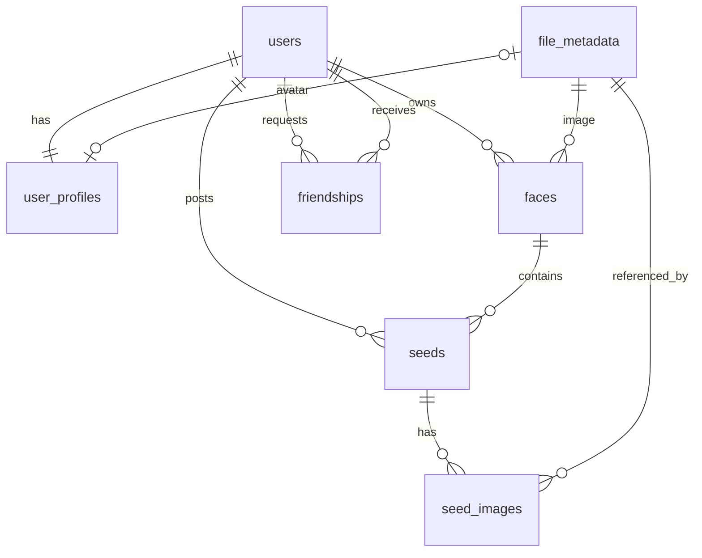

_This project has been created as part of the 42 curriculum by hurabe, nkawaguc, katakada, kharuya._

# Description

**MultiFace** is a personal activity-log service for writing down your daily activities, organized by the different "faces" a person has.

## Purpose

In services designed around "connecting with others," the more you post, the more you become conscious of other people's eyes. MultiFace does not aim to be that kind of social network: it deliberately has no likes, replies, or mentions. Its purpose is **writing down what you love without worrying about anyone's reaction**.

In MultiFace, a user has multiple "**faces**" corresponding to their interests and roles, and posts to whichever face fits the moment. A reading face, a movie face, a diary face — you can keep contexts separate within a single account.

## Key Features

- **Authentication**: sign-up / sign-in / sign-out / token refresh (JWT + refresh tokens, stored in httpOnly Cookies)
- **Faces**: create a category per facet of yourself, and set it public or private
- **Seeds (activities)**: posts tied to a face. Supports body text plus multiple image and PDF attachments
- **Friendship**: request / accept / block / remove, friend list and pending-request list
- **Presence**: managing and displaying users' online status
- **User profile**: display name, badge, and avatar image management
- **File storage**: image upload / download / delete (separate public and private buckets)
- **Internationalization**: three languages — English, French, and Japanese (`next-intl`)
- **Operations platform**: metrics monitoring with Prometheus + Grafana + Alertmanager, log visualization with Elasticsearch + Logstash + Kibana

# Instruction

## Prerequisites

| Item    | Version / condition                                                          |
| ------- | ---------------------------------------------------------------------------- |
| Docker  | Docker Desktop or OrbStack must be running                                   |
| VS Code | Dev Containers extension must be enabled                                     |
| Node.js | 24 (provided inside the Dev Container)                                       |
| pnpm    | 11.16.0 (pinned in `packageManager`; enabled automatically through corepack) |
| mkcert  | Required only when running the production-like environment (local-prod)      |

Running the development environment through the **VS Code Dev Container** is recommended. Deployment operations for the production-like environment (docker / mkcert / hosts changes) should be run **on the host OS** (the Dev Container is for editing).

## Environment Variables

This repository uses environment variable files. There are two kinds, one per purpose, and both are created by copying an example file.

```bash
cp .env.dev.example .env.dev           # for the development environment
cp .env.example .env                   # for the production-like environment
```

The main variables are listed below (see each `.example` file for details).

| Variable                                               | Description                                                           |
| ------------------------------------------------------ | --------------------------------------------------------------------- |
| `NODE_ENV`                                             | Run mode (development / production)                                   |
| `POSTGRES_DB` / `POSTGRES_USER` / `POSTGRES_PASSWORD`  | PostgreSQL connection settings                                        |
| `DATABASE_URL`                                         | Connection URL used by the backend (Drizzle / postgres.js)            |
| `RUN_MIGRATIONS`                                       | Whether to run migrations automatically on startup                    |
| `REDIS_PASSWORD`                                       | Redis authentication password                                         |
| `PEPPER`                                               | Pepper (secret value) added to password hashing                       |
| `JWT_ISSUER`                                           | JWT issuer                                                            |
| `ACCESS_TOKEN_EXPIRES_IN` / `REFRESH_TOKEN_EXPIRES_IN` | Token lifetimes                                                       |
| `FILE_STORAGE_BASE_DIR`                                | Directory where uploaded files are stored                             |
| `APP_API_BASE_URL`                                     | Base URL the BFF (Next.js server) uses to call the backend            |
| `NEXT_PUBLIC_BFF_API_BASE_URL`                         | Base URL the browser uses to call the BFF API (exposed to the client) |
| `GF_SECURITY_ADMIN_PASSWORD` and others                | Grafana / Elasticsearch / Kibana / Logstash settings                  |

## Setting Up the Development Environment

1. Clone the repository
2. Create the environment variable file

```bash
cp .env.dev.example .env.dev
```

- When developing in the 42 environment, follow the separate steps in [42_DEV_ENVIRONMENT.md](./docs/for_dev/42_DEV_ENVIRONMENT.md).

## Starting the Development Environment

1. Open the repository in VS Code
2. Run **Reopen in Container**
3. In a terminal inside the Dev Container, run the following

```bash
# Apply development environment variables and generate the JWT private key
pnpm make-env

# Apply the database schema
pnpm --filter @tracen/backend db:push
```

- On first launch, `postCreateCommand` runs `pnpm install`.
- The Dev Container is configured in `.devcontainer/devcontainer.json`.
- When the Dev Container starts, the services in `docker-compose.dev.yml` start with it.

  - Application: `dev-container` / `frontend` / `backend` / `nginx` / `db` / `redis`

- The following are started by manual scripts.
  - Monitoring: `prometheus` / `grafana` / `alertmanager` and the exporters (node / cAdvisor / postgres / redis / nginx)
  - Log visualization (only when the `analytics` profile is specified): `elasticsearch` / `kibana` / `logstash` / `filebeat`

To start the dev server directly from the repository root, run:

```bash
pnpm dev
```

## Verifying It Works

| Purpose                            | URL                           |
| ---------------------------------- | ----------------------------- |
| Browser entry point (via Nginx)    | http://localhost:8080         |
| Next.js direct access (debugging)  | http://localhost:3000         |
| Hono API direct access (debugging) | http://localhost:8000/api/v1/ |
| BFF API                            | http://localhost:8080/api/    |
| PostgreSQL                         | localhost:5432                |
| Redis                              | localhost:6379                |
| Grafana                            | http://localhost:3001         |
| Prometheus                         | http://localhost:9090         |
| Alertmanager                       | http://localhost:9093         |
| Kibana (analytics profile)         | http://localhost:8080/kibana  |

Nginx forwards both `/api/*` and `/*` to `frontend:3000`, and the BFF calls `backend:8000` as needed.

## Setting Up the Production-like Environment (local-prod)

### Prerequisites:

- mkcert must be installed
- The repository must be cloned

### Step 1: Configure hosts

Add the following to `/etc/hosts` on the host OS.

```
127.0.0.1 tracen.local registry.tracen.local api.tracen.local kibana.tracen.local
```

### Step 2: Create the environment variable file

```bash
cp .env.example .env
```

### Step 3: Generate TLS material

```bash
bash scripts/setup-local-prod-tls.sh
```

### Step 4: Make Docker trust the local registry's CA

```bash
sudo mkdir -p /etc/docker/certs.d/registry.tracen.local:5000
sudo cp containers/infra/local-prod/certs/ca.crt /etc/docker/certs.d/registry.tracen.local:5000/ca.crt
```

## Running the Production-like Environment (local-prod)

A single command starts a production-like setup on your local PC: prebuilt images + a local registry + HTTPS.

Depending on your environment, Docker may need to be restarted.

### Deploy

```bash
# To start only frontend / backend + monitoring
bash scripts/deploy-local-prod.sh

# To start all containers including analytics
WITH_ANALYTICS=1 bash scripts/deploy-local-prod.sh
```

- Entry point: https://tracen.local
- BFF API: https://tracen.local/api/
- backend API: https://api.tracen.local/api/v1/
- monitoring: https://tracen.local/grafana
- analytics: https://kibana.tracen.local

## Stopping and Cleaning Up

```bash
# Development environment
docker compose -f docker-compose.dev.yml down

# Production-like environment
bash scripts/down-local-prod.sh
```

## Discord Notifications via Alertmanager

Prometheus evaluates the rules in `containers/infra/monitoring/prometheus/alert.rules.yml`, and Alertmanager groups the fired alerts by `alertname` and notifies a Discord webhook. There are currently three rules.

| Alert            | Condition                                                          | severity |
| ---------------- | ------------------------------------------------------------------ | -------- |
| `TargetDown`     | A monitored target (including exporters) is down for over 1 minute | critical |
| `HostHighMemory` | Host memory usage above 85% for 5 minutes                          | warning  |
| `HostHighCPU`    | Host CPU usage above 85% for 5 minutes                             | warning  |

### Step 1: Configure the webhook URL

The webhook URL is secret and therefore not tracked by git (already in `.gitignore`). Copy the sample and write the Discord webhook URL on a single line.

```bash
cp containers/infra/monitoring/alertmanager/secret/webhook_url.example \
   containers/infra/monitoring/alertmanager/secret/webhook_url
```

If you do not want notifications, you do not need to do anything. Alertmanager starts normally even without this file; only the alert notifications are skipped, and everything else works as usual.

### Step 2: Start the monitoring stack

The monitoring containers do not start automatically in the development environment, so start them manually.

```bash
pnpm pg:up
```

In the production-like environment (local-prod), this is included in `bash scripts/deploy-local-prod.sh`.

### Applying Configuration Changes

- **Creating or changing `secret/webhook_url`**: no container restart is required. The whole `secret/` directory is mounted (in both dev and local-prod), and `webhook_url_file` is re-read on every notification, so the change takes effect from the next notification.
- **Changing `alertmanager/config.yml`**: the configuration is only read at startup, so a restart is required.

  ```bash
  docker compose -f docker-compose.dev.yml restart alertmanager
  ```

### Verifying It Works

Stopping one exporter makes `up == 0`, and `TargetDown` fires one minute later.

```bash
docker compose -f docker-compose.dev.yml stop redis-exporter
# Check Pending -> Firing at http://localhost:9090/alerts
docker compose -f docker-compose.dev.yml start redis-exporter
```

For the overall structure of the monitoring platform and the Grafana dashboards, see `containers/infra/monitoring/README.md`.

# Resources

## References

### Service Concept

- Trickle, a service for writing more freely than you browse
- Trickle's feature introduction (activity-log service)
- "Trickle," a service about enjoying writing itself rather than viewing or talking

### Technical Documentation

- [Next.js official documentation](https://nextjs.org/docs)
- [Hono official documentation](https://hono.dev/docs/)
- [Drizzle ORM official documentation](https://orm.drizzle.team/docs/overview)
- [PostgreSQL official documentation](https://www.postgresql.org/docs/)
- [Redis official documentation](https://redis.io/documentation/)
- [Nginx official documentation (reverse proxy and TLS configuration)](https://nginx.org/en/docs/http/ngx_http_proxy_module.html)
- [Prometheus official documentation](https://prometheus.io/docs/)
- [Grafana official documentation](https://grafana.com/docs/)
- [Alertmanager official documentation](https://prometheus.io/docs/alerting/latest/alertmanager/)
- [Elasticsearch official documentation](https://www.elastic.co/guide/index.html)
- [Logstash official documentation](https://www.elastic.co/docs/reference/logstash)
- [Kibana official documentation](https://www.elastic.co/docs/reference/kibana)
- [Filebeat official documentation](https://www.elastic.co/docs/reference/beats/filebeat)
- [mkcert repository (local HTTPS with a local CA)](https://github.com/FiloSottile/mkcert)

### In-project Documentation

| Document                                       | Contents                                                              |
| ---------------------------------------------- | --------------------------------------------------------------------- |
| `docs/DEVELOPMENT.md`                          | Development environment procedures                                    |
| `docs/architecture/ARCHITECTURE.md`            | Overall project architecture                                          |
| `docs/contracts/CONTRACTS_GUIDE.md`            | Guide for working with shared types and schemas                       |
| `docs/deploy/LOCAL_PROD_DEPLOYMENT.md`         | Deployment steps for the production-like environment                  |
| `docs/test/LOCAL_CI_LOCAL_PROD.md`             | How to run local CI                                                   |
| `docs/for_dev/EDITORCONFIG_SETUP.md`           | EditorConfig setup                                                    |
| `docs/for_dev/GIT_HOOKS_LOCAL_VALIDATION.md`   | Local validation through Git hooks                                    |
| `docs/for_dev/LINTER_SETUP.md`                 | Linter (ESLint) setup                                                 |
| `docs/for_dev/PRETTIER_SETUP.md`               | Prettier setup                                                        |
| `docs/for_dev/SECURITY_EXCEPTION_3DAY_RULE.md` | Security exception handling rules                                     |
| `docs/api/backend/api-key-openapi.yaml`        | Backend API spec (API-key authentication, for administrators)         |
| `docs/api/backend/jwt-auth-openapi.yaml`       | Backend API spec (JWT access-token authentication, for regular users) |
| `docs/api/backend/public-openapi.yaml`         | Backend API spec (public API, no authentication required)             |

## Use of AI

Throughout this project we continuously used generative AI (Claude Code / GitHub Copilot) as a development aid.

### Tasks Where AI Was Used

| Target                 | How it was used                                                                                                                              |
| ---------------------- | -------------------------------------------------------------------------------------------------------------------------------------------- |
| Filing issues          | Created issues following the templates via `.claude/skills/github-create-issue` and `.github/agents/issue-creator.agent.md`                  |
| Implementation support | Progressed implementation issue by issue via `.claude/skills/github-impl-issue` and `.github/agents/issue-implementer.agent.md`              |
| Commits / PRs          | Standardized commit messages and PR descriptions via `.claude/skills/github-commit`, `.claude/skills/github-make-pr`, and `.github/skills/*` |
| Technical research     | Researched external information via `.claude/skills/web-search`                                                                              |
| Documentation          | Drafted and reviewed the design and procedure documents under `docs/`                                                                        |

### Areas Decided by Humans

- Final architecture decisions, module selection, and finalizing the DB schema
- Judging whether changes involving security, authentication, or secrets were acceptable
- Policy for handling vulnerabilities in dependencies (including exception handling)

# Team Information

- hurabe (PM + Developers): progress management and task assignment, infrastructure design and construction of the log visualization platform (ELK) — including end-to-end HTTPS, authentication, and log retention policy design — and implementation reviews
- nkawaguc (PO + Developers): service concept, product direction decisions, monitoring platform implementation
- katakada (Tech Lead + Developers): architecture design, technology selection, CI pipeline design, development environment setup, backend implementation
- kharuya (Developers): frontend / BFF implementation

# Project Management

## Task Management

All tasks were managed with **GitHub Issues**. To keep the granularity and content of issues consistent, blank issues are disabled (`blank_issues_enabled: false`) and the following six templates are provided.

- `bug_report`
- `feature_request`
- `documentation`
- `performance`
- `refactor`
- `ui_ux_improvement`

Work followed the flow "file an issue → create a branch → implement → PR → review → merge," with ownership assigned per issue.

## Label Usage

Issues are labeled with prefixed labels so that "which area," "which priority," and "which size" can be told at a glance. This lets us assign owners and decide what to work on next just by filtering labels.

| Category             | Labels                                                                                                   | Purpose                                                          |
| -------------------- | -------------------------------------------------------------------------------------------------------- | ---------------------------------------------------------------- |
| Area                 | `area:frontend` / `area:backend` / `area:contracts` / `area:db` / `area:infra` / `area:ci` / `area:docs` | Indicates the layer affected by the change                       |
| Priority             | `priority:p0` – `priority:p3`                                                                            | Deciding what to work on first                                   |
| Size                 | `size:XS` / `size:S` / `size:M` / `size:L`                                                               | A guide for estimation and splitting                             |
| Subject requirements | `mandatory` / `module:major` / `module:minor`                                                            | Mapping to mandatory requirements and modules                    |
| Other                | `epic` / `type:design` / `onboarding` / `question`                                                       | Large groupings, design discussion, environment setup, questions |

## Communication

- **Discord**: day-to-day discussion and progress sharing. Alerts from the monitoring platform's Alertmanager are also sent to Discord
- **Documentation**: decisions and procedures are recorded under `docs/` rather than left as verbal agreements

## Quality Gates

Quality is enforced by **Git hooks and local CI** rather than a CI server.

| Timing       | What runs                                                                                                       |
| ------------ | --------------------------------------------------------------------------------------------------------------- |
| `pre-commit` | `lint-staged` (ESLint + Prettier), `pnpm audit`, `secrets:scan` (gitleaks), `osv:scan-lockfiles` (OSV-Scanner)  |
| `pre-push`   | `pnpm typecheck`, `pnpm local-ci:fast` (build, start, smoke-test, and clean up the production-like environment) |
| Optional     | `pnpm local-ci:full` (startup verification including the production-like registry)                              |

Local CI actually brings up `docker-compose.local-prod.yml` and verifies `https://tracen.local/api/health`, the test scripts, and connectivity to the top page. This catches early on whether an in-progress change has broken the production-like deployment.

## Security Practices

- Vulnerabilities in dependencies are detected with `pnpm audit` and OSV-Scanner, and pinned to safe versions through `overrides` in `pnpm-workspace.yaml`
- For vulnerabilities that cannot be resolved immediately, a time-boxed handling rule is defined (`docs/for_dev/SECURITY_EXCEPTION_3DAY_RULE.md`)
- gitleaks checks for leaked secrets before each commit

# Technical Stack

## Architecture Diagram

```
Browser
  │  HTTP (development) / HTTPS (production-like)
  ▼
Nginx (reverse proxy)
  │
  ▼
frontend-bff (Next.js)
  - React Server / Client Components
  - Server Actions / Route Handlers
  - server/usecases + repositories
  │  Hono RPC (server-to-server only)
  ▼
backend (Hono)
  ├─▶ PostgreSQL
  └─▶ Redis
```

## Technologies Used

| Layer                    | Technologies                                                                           |
| ------------------------ | -------------------------------------------------------------------------------------- |
| Frontend / BFF           | Next.js, React, Tailwind CSS, next-intl, react-hook-form, Zod, lucide-react, Storybook |
| Backend                  | Hono, Vite                                                                             |
| Shared types and schemas | @tracen/contracts (Zod schemas), Hono RPC client (hc)                                  |
| Database                 | PostgreSQL, Drizzle ORM, postgres.js, drizzle-kit                                      |
| Cache / short-lived data | Redis (ioredis)                                                                        |
| Authentication           | argon2 (+ pepper), JWT, public JWKS endpoint, jose                                     |
| Reverse proxy            | Nginx (development: HTTP; production-like: HTTPS + upstream certificate verification)  |
| Monitoring               | Prometheus, Grafana, Alertmanager, various exporters                                   |
| Log visualization        | Elasticsearch, Logstash, Kibana, Filebeat                                              |
| Testing                  | Vitest, shell-script API tests, local-prod smoke tests                                 |
| Development environment  | Docker Compose, Dev Container, pnpm, local Docker registry, mkcert                     |
| Quality management       | ESLint, Prettier, EditorConfig, husky, lint-staged, gitleaks, OSV-Scanner              |

## Rationale for Technology Choices

### Monorepo + Shared Schema Package

We adopted a pnpm workspaces monorepo because we wanted API types drifting between frontend and backend to be prevented by construction, not by review. The shapes of requests and responses are defined once as Zod schemas in `@tracen/contracts`; the backend uses them for runtime validation, and the frontend uses the same definitions for types and form validation. Changing a contract immediately surfaces as a type error on both sides.

### BFF Pattern (Next.js)

Rather than letting the browser call the backend API directly, every call goes through the Next.js server side (Route Handlers / Server Actions / usecases). This keeps access tokens confined to httpOnly Cookies, and keeps presentation-driven data shaping out of the backend's API design. The backend API can even be kept private from the outside in the production-like setup (it is currently exposed temporarily in order to implement one of the subject modules).

### Hono

For the backend we chose Hono: lightweight, fast, and a good fit for TypeScript. The deciding factor was its **RPC feature** — client-side types are derived from the router definition, making calls from the BFF type-safe per endpoint. Its integration with Zod validators, which lets us use the contract package's schemas directly for input validation, was another reason.

### PostgreSQL

We judged that a relational database — one that can express the model declaratively and guarantee cascading deletes on foreign keys at the DB level — was the right fit. Among those, we chose PostgreSQL for its rich feature set (enum types, partial indexes, JSON types) and its proven track record running under Docker.

### Drizzle ORM

We valued being able to define the schema in TypeScript and generate both types and migrations from it. Query results are typed while the code still reads close to SQL, and since it uses no proprietary file format, there are fewer needless abstraction layers and a smaller bundle size — which keeps the code transparent.

### Redis

Presence (online status) and refresh tokens are data that change frequently and rely on automatic expiry via TTL. Keeping them in PostgreSQL would add write load and unnecessary persistence, so we moved them to Redis, which has TTL as a built-in feature.

### argon2 + Pepper

To limit the damage of a DB leak, we inject a pepper (a secret salt) from an environment variable. For the password hashing itself we chose argon2 — a memory-hard design (it deliberately occupies a certain amount of physical memory during hashing) that resists GPU-parallel brute-force attacks and is officially recommended by the **IETF (RFC 9106)**.

### JWT (JSON Web Token) + JWKS (JSON Web Key Set)

To achieve a stateless implementation, we use JWTs as short-lived access tokens, combined with long-lived refresh tokens (with revocation management) to reduce the risk from token leakage or misuse. To reduce trips to the auth server for token verification, we distribute the public key as a JWKS at `/.well-known/jwks.json`, allowing verifiers to validate tokens independently. The fact that the same mechanism can be reused if the service is later split up was another reason for this choice.

### Separating the Monitoring and Logging Platforms

To gain observability without modifying the application itself, metrics are collected by Prometheus from each service's exporter, and logs are collected by Filebeat from the containers' standard output. The application only has to "print JSON in a fixed shape to stdout," which keeps it loosely coupled to the collection platform.

# Database Schema

## ER Diagram



## Table Definitions

### users

| Column          | Type      | Constraints / description               |
| --------------- | --------- | --------------------------------------- |
| `id`            | uuid      | Primary key · ID                        |
| `email`         | text      | NOT NULL / unique index · Email address |
| `name`          | text      | NOT NULL · Registered name              |
| `password_hash` | text      | NOT NULL · Password hash                |
| `created_at`    | timestamp | NOT NULL · Created at                   |

### user_profiles

| Column           | Type      | Constraints / description                                                         |
| ---------------- | --------- | --------------------------------------------------------------------------------- |
| `id`             | uuid      | Primary key · ID                                                                  |
| `name`           | text      | NOT NULL · Display name                                                           |
| `badge`          | text      | Badge emoji                                                                       |
| `avatar_file_id` | uuid      | References `file_metadata.id` (unique, SET NULL on delete) · Avatar image file ID |
| `user_id`        | uuid      | NOT NULL / references `users.id` (unique, CASCADE on delete) · User ID            |
| `created_at`     | timestamp | NOT NULL · Created at                                                             |
| `updated_at`     | timestamp | NOT NULL · Updated at                                                             |

### file_metadata

| Column        | Type         | Constraints / description                    |
| ------------- | ------------ | -------------------------------------------- |
| `id`          | uuid         | Primary key · ID                             |
| `owner_id`    | uuid         | NOT NULL · Owner ID (user ID)                |
| `bucket`      | varchar(63)  | NOT NULL · Bucket name                       |
| `storage_key` | varchar(512) | NOT NULL / unique · Relative path in storage |
| `file_name`   | varchar(255) | NOT NULL · Original file name at upload time |
| `mime_type`   | varchar(100) | NOT NULL · Content-Type                      |
| `file_size`   | integer      | NOT NULL · File size                         |
| `created_at`  | timestamp    | NOT NULL · Created at                        |
| `updated_at`  | timestamp    | NOT NULL · Updated at                        |

### faces

| Column        | Type      | Constraints / description                                               |
| ------------- | --------- | ----------------------------------------------------------------------- |
| `id`          | uuid      | Primary key · ID                                                        |
| `user_id`     | uuid      | NOT NULL / references `users.id` (CASCADE on delete) · User ID          |
| `name`        | text      | NOT NULL · Face name                                                    |
| `emoji`       | text      | Face emoji                                                              |
| `description` | text      | Face description                                                        |
| `image_id`    | uuid      | References `file_metadata.id` (SET NULL on delete) · Face image file ID |
| `visibility`  | enum      | NOT NULL · Visibility status                                            |
| `created_at`  | timestamp | NOT NULL · Created at                                                   |
| `updated_at`  | timestamp | NOT NULL · Updated at                                                   |

Index: `idx_faces_user_id` (for fetching your own list of faces)

### seeds

| Column       | Type      | Constraints / description                                      |
| ------------ | --------- | -------------------------------------------------------------- |
| `id`         | uuid      | Primary key · ID                                               |
| `user_id`    | uuid      | NOT NULL / references `users.id` (CASCADE on delete) · User ID |
| `face_id`    | uuid      | NOT NULL / references `faces.id` (CASCADE on delete) · Face ID |
| `body`       | text      | NOT NULL · Body text                                           |
| `created_at` | timestamp | NOT NULL · Created at                                          |
| `updated_at` | timestamp | NOT NULL · Updated at                                          |

Indexes: `idx_seeds_user_id` (for fetching a user's seed list), `idx_seeds_face_id` (for fetching a face's seed list)

### seed_images

A join table representing the many-to-many relationship between seeds and images.

| Column          | Type    | Constraints / description                                                         |
| --------------- | ------- | --------------------------------------------------------------------------------- |
| `seed_id`       | uuid    | NOT NULL / references `seeds.id` (CASCADE on delete) · Seed ID                    |
| `image_id`      | uuid    | NOT NULL / references `file_metadata.id` (CASCADE on delete) · Seed image file ID |
| `display_order` | integer | NOT NULL · Display order index                                                    |

Constraints: composite primary key on `(seed_id, image_id)`, unique constraint on `(seed_id, display_order)`

Index: `idx_seed_images_image_id` (for reverse lookup by image_id)

### friendships

| Column         | Type        | Constraints / description                                                  |
| -------------- | ----------- | -------------------------------------------------------------------------- |
| `id`           | uuid        | Primary key · ID                                                           |
| `requester_id` | uuid        | NOT NULL / references `users.id` (CASCADE on delete) · Requester (user ID) |
| `addressee_id` | uuid        | NOT NULL / references `users.id` (CASCADE on delete) · Addressee (user ID) |
| `status`       | enum        | NOT NULL · Friendship status                                               |
| `created_at`   | timestamptz | NOT NULL · Created at                                                      |
| `updated_at`   | timestamptz | NOT NULL · Updated at                                                      |

Constraint: unique constraint on `(requester_id, addressee_id)` (prevents duplicate requests)

Indexes: `(idx_friendships_requester_status)` (for finding requests you sent), `(idx_friendships_addressee_status)` (for finding requests addressed to you)

## Migrations

The TypeScript definitions in Drizzle ORM are the source of truth for the schema, and it is applied through the SQL migrations generated by `drizzle-kit` (`containers/apps/backend/drizzle/`). When `RUN_MIGRATIONS=true`, they are applied automatically when the backend starts.

# Features List

## Authentication and Accounts

| Feature         | Overview                                                                                                     | Owner              |
| --------------- | ------------------------------------------------------------------------------------------------------------ | ------------------ |
| Sign-up         | Registration by email and password. Hashed with argon2 + pepper, and a profile is created at the same time   | katakada / kharuya |
| Sign-in         | On successful authentication, issues an access token and a refresh token and stores them in httpOnly cookies | katakada / kharuya |
| Sign-out        | Revokes the refresh token and clears the cookies                                                             | katakada / kharuya |
| Token refresh   | Re-issues an access token using the refresh token                                                            | katakada / kharuya |
| JWKS publishing | Distributes the public key for verification at `/.well-known/jwks.json`                                      | katakada           |

## Profile and Users

| Feature              | Overview                                             | Owner              |
| -------------------- | ---------------------------------------------------- | ------------------ |
| Get / update profile | Reading and updating display name, badge, and avatar | katakada / kharuya |
| Bulk profile fetch   | Fetching multiple users' profiles at once            | katakada / kharuya |
| User management API  | Creating, fetching, and deleting users               | katakada           |
| Presence             | Recording and reading online status                  | katakada           |

## Faces and Seeds (Posts)

| Feature                    | Overview                                                              | Owner              |
| -------------------------- | --------------------------------------------------------------------- | ------------------ |
| Create / list / view faces | Creating a category per facet of yourself, with list and detail views | katakada / kharuya |
| Posting seeds              | Posting body text tied to a face                                      | katakada / kharuya |
| Attaching images to seeds  | Attaching multiple images with a display order                        | katakada / kharuya |
| Seed detail view           | An individual seed detail page and a fetch API through the BFF        | katakada / kharuya |

## Friendship

| Feature                  | Overview                                             | Owner              |
| ------------------------ | ---------------------------------------------------- | ------------------ |
| Friend request           | Creating a request to a target user                  | katakada / kharuya |
| Accept / reject requests | Updating the status of a received request            | katakada / kharuya |
| Block                    | Blocking a target user                               | katakada / kharuya |
| Remove friend            | Deleting an established relationship                 | katakada / kharuya |
| Friend list              | Listing established friends                          | katakada / kharuya |
| Pending request list     | Listing pending requests, both incoming and outgoing | katakada / kharuya |

## File Storage

| Feature        | Overview                                               | Owner              |
| -------------- | ------------------------------------------------------ | ------------------ |
| Upload         | Saving a file and registering its metadata             | katakada / kharuya |
| Download       | Serving a file after checking ownership and visibility | katakada / kharuya |
| Delete         | Deleting both the file itself and its metadata         | katakada / kharuya |
| Static serving | Serving static files from the public bucket            | katakada           |

## Screens and UX

| Feature                           | Overview                                                       | Owner    |
| --------------------------------- | -------------------------------------------------------------- | -------- |
| Home                              | A list of your own activities                                  | kharuya  |
| Friends                           | The list screen                                                | kharuya  |
| Profile screen                    | Displaying each user's profile                                 | kharuya  |
| Settings screen                   | User settings                                                  | kharuya  |
| Terms of service / privacy policy | Static pages (internationalized)                               | nkawaguc |
| Internationalization              | English, French, and Japanese, switched via `[locale]` routing | kharuya  |
| Component catalog                 | Reviewing UI components with Storybook                         | kharuya  |

## Operations and Platform

| Feature                    | Overview                                                                                         | Owner    |
| -------------------------- | ------------------------------------------------------------------------------------------------ | -------- |
| Health check               | `/api/health` (checks through the BFF all the way to the backend), `/health/redis`               | katakada |
| Metrics monitoring         | Visualizing host, container, PostgreSQL, Redis, and Nginx metrics with Prometheus + Grafana      | nkawaguc |
| Alert notifications        | Notifications from Alertmanager to Discord                                                       | nkawaguc |
| Log visualization          | The Filebeat → Logstash → Elasticsearch → Kibana pipeline                                        | hurabe   |
| Production-like deployment | One-command deployment to a local-registry + HTTPS setup                                         | katakada |
| Local CI                   | Automatically building, starting, smoke-testing, and cleaning up the production-like environment | katakada |

## Known Limitations

- Video attachments are not supported.
- CI runs through local CI and Git hooks rather than GitHub Actions.

# Modules

We implemented 8 major modules and 6 minor modules, for a total of 22 points.

## 1 Web

### Major: Use a framework for both the frontend and backend.

- Owners: kharuya, katakada

* **Justification:**
  To keep the API schemas of the frontend and backend in sync by construction, enabling robust, type-safe full-stack development.
* **Implementation:**
  - **Frontend / BFF (Backend for Frontend):** Adopted **Next.js 16 (App Router)**. Instead of letting the browser call the backend API directly, we built a BFF pattern where every call goes through the Next.js server side (Route Handlers / Server Actions). This keeps access tokens confined to httpOnly cookies for secure communication.
  - **Backend:** Adopted **Hono 4**, which is extremely lightweight and TypeScript-friendly.
  - **Shared types and schemas:** Taking advantage of the `pnpm workspaces` monorepo, Zod schemas are defined in one place inside the shared package `@tracen/contracts`. By using **Hono's RPC feature**, which derives client-side types from the router definition, we get complete type safety per endpoint for BFF-to-backend communication.

### Major: A public API to interact with the database with a secured API key, rate limiting, documentation, and at least 5 endpoints:

- Owner: katakada

* **Justification:**
  So that the BFF server and third-party developers can manipulate data in the database (user authentication and CRUD) safely and in a controlled way, without going through a browser.
* **Implementation:**
  - **Secured API key:** Implemented authentication logic on the backend that securely verifies an administrator/third-party API key (`MASTER_API_KEY`), injected via the local `.env`, through a request header (e.g. `X-API-Key`).
  - **Rate limiting:** Applied rate-limit protection using the environment variable `MASTER_API_KEY_RATE_LIMIT`, defending the database and backend API against DDoS attacks and abusive access.
  - **Documentation:** Provided a detailed API specification in OpenAPI (Swagger) format at `docs/api/backend/api-key-openapi.yaml`.
  - **At least 5 endpoints:** Provided the following five or more substantive database-operation endpoints, covering CRUD against the database as well as registration and authentication.
    - `POST /api/v1/auth/sign-up` (register/create a user)
    - `POST /api/v1/auth/sign-in` (authenticate a user)
    - `POST /api/v1/auth/refresh` (re-issue the JWT and refresh token)
    - `GET /api/v1/admin/users/{id}` (admin: fetch user details)
    - `PUT /api/v1/admin/users/{id}` (admin: update user information)
    - `DELETE /api/v1/admin/users/{id}` (admin: delete user information)

### Minor: Use an ORM for the database.

- Owner: katakada

* **Justification:**
  To define the database schema declaratively with TypeScript code as the single source of truth, combining type-safe SQL queries with sound type inference and automatic migrations that keep the schema consistent.
* **Implementation:**
  - Adopted the TypeScript-first **Drizzle ORM** together with **postgres.js** as the PostgreSQL client library.
  - Used `drizzle-kit` to generate SQL migration files (under `containers/apps/backend/drizzle/`) directly from the TypeScript schema definitions.
  - By setting `RUN_MIGRATIONS=true` in `docker-compose.local-prod.yml`, the migration script runs automatically when the container starts, giving us a robust automatic application system that creates and updates the database schema in sync.

### Minor: Server-Side Rendering (SSR) for improved performance and SEO.

- Owner: kharuya

* **Justification:**
  To securely block, on the server side, the flicker and the momentary rendering of unauthenticated screens (session leakage) that tend to occur in SPAs while waiting for client-side initial data fetches — maximizing FCP (First Contentful Paint) and SEO.
* **Implementation:**
  - Adopted **React Server Components (RSC)** from the **Next.js App Router (Next.js 16 / React 19)**. Major pages such as user profiles, settings, and face/seed (post) lists are pre-rendered on the server (SSR) and delivered.
  - Built a **BFF (Backend for Frontend) pattern**, strictly routing everything through the Next.js server side (Route Handlers / Server Actions) instead of letting the browser call the backend API directly. On the server, the JWT access token is safely extracted from the session cookie (`httpOnly`), the backend (Hono:8000) API is called quickly over server-to-server communication, and the initial data is merged and delivered to the client immediately as complete HTML.

### Minor: Custom-made design system with reusable components, including a proper color palette, typography, and icons (minimum: 10 reusable components).

- Owner: kharuya

* **Justification:**
  To provide a consistent brand experience (colors, typography, icons) in harmony with MultiFace's tone and manner — "writing down your interests across multiple faces without worrying about others' reactions" — and to reduce duplication in UI code, improving the quality and maintainability of the frontend.
* **Implementation:**
  - A fully original design system built on **Tailwind CSS 4** and **lucide-react**.
  - Implemented the following **10+ reusable components** from scratch.
    1.  `Button`: a base button with dynamic variants (Primary/Secondary/Danger) and adjustable sizes.
    2.  `Input`: a text input field fully wired to client-side form validation (`react-hook-form` / `Zod`).
    3.  `Avatar`: displays the image according to user settings, with a default fallback when no image is set.
    4.  `Badge`: a mini badge for user badges, connection status, or post metadata.
    5.  `Dialog / Modal`: a modal popup used for shared alerts, confirmations, and creating new faces.
    6.  `Card / FaceCard`: a display card that wraps face information (name, emoji, description, visibility) in a consistent style.
    7.  `SeedCard`: a post component containing the body text, a grid layout of multiple images, and the delete action.
    8.  `Tabs`: tabs for smoothly switching between profile views and content lists without a page transition.
    9.  `Spinner / Loading`: an animated indicator while waiting for API responses.
    10. `LanguageSelector`: a dropdown that works with next-intl to seamlessly switch languages (English, Japanese, French).
  - All components are cataloged with **Storybook 8**, making visual checks and behavior guarantees easy.

### Minor: Implement advanced search functionality with filters, sorting, and pagination.

- Owners: kharuya, katakada

* **Justification:**
  To provide a good UX where users can reach the data they want instantly, without putting unnecessary query load on the database, even as the amount of face, seed (post), and friendship data grows.
* **Implementation:**
  - **Database optimization and query design:** Designed appropriate indexes on PostgreSQL (`idx_seeds_face_id`, `idx_seeds_user_id`). On the Hono backend, implemented fast, memory-efficient reads using Drizzle ORM's `where`, `limit`, `offset`, and `orderBy`.
  - **Filtering:** Narrowing by a specific face (`face_id`), plus display restriction filters based on public/private (`visibility`) authorization status.
  - **Sorting:** Dynamic sorting by post date (`created_at`), newest or oldest first, and by `display_order` (the order of seed images).
  - **Pagination:** Implemented a stateless pagination system tied to URL query parameters (URLSearchParams) on the Next.js frontend. Fetching and rendering data incrementally (e.g. 10 items at a time) dramatically optimizes network bandwidth and initial rendering cost on first load.

### Minor: File upload and management system.

- Owners: kharuya, katakada

* **Justification:**
  So that users can attach multiple images to seeds (posts) and securely upload and manage an avatar image per account.
* **Implementation:**
  - **Validation:** Both the frontend (BFF) and the backend enforce safe validation of file size (e.g. 5MB) and MIME type (restricting image formats through MIME detection).
  - **Metadata management and persistence:** Metadata for uploaded files (bucket, storage_key, file_name, file_size, owner_id, etc.) is recorded in the `file_metadata` table in PostgreSQL, while the actual files are stored safely in the persistent volume `file_storage_data` mounted on the host (`FILE_STORAGE_BASE_DIR`).
  - **Bucket separation (access control):** Built a bucket design based on AWS S3-like concepts, with a public bucket (`public-bucket`) accessible without login and a private bucket (`private-bucket`) that only serves files after verifying the JWT holder's authorization.
  - **Full feature coverage:** Covers a client-side upload progress indicator, previews, and deletion of images associated with seed posts through the many-to-many join table `seed_images`.

## 2 Accessibility and Internationalization

### Minor: Support for multiple languages (at least 3 languages).

- Owners: kharuya, nkawaguc

* **Justification:**
  MultiFace assumes users beyond Japanese speakers, and hard-coding UI text would mean starting any later internationalization by hunting down all user-facing text. By adopting `next-intl` early and creating translation keys alongside component implementation, we aimed to structurally prevent i18n leaks.
* **Implementation:**
  - **Routing:** Adopted `next-intl`'s `[locale]` segment routing. The supported locales (`ja` / `en` / `fr`, default `ja`) are defined in `src/i18n/routing.ts`, and `next-intl`'s `createMiddleware` is composed with the authentication check and run inside the middleware (`src/proxy.ts`). When no locale is specified, it is auto-detected from the cookie (`NEXT_LOCALE`) and the browser's `Accept-Language`, and the request is redirected.
  - **Message management:** JSON is split per namespace (the main `messages/{locale}.json`, plus `messages/terms/{locale}.json` and `messages/privacy/{locale}.json`) and merged in `src/i18n/request.ts` before being served. Separating long static pages such as the terms of service and privacy policy from short UI text makes diffs easier for translators to follow.
  - **Switcher UI:** The `LanguageSwitcher` component uses `next-intl`'s `useRouter` / `usePathname` (obtained from `createNavigation` in `src/i18n/navigation.ts`) to implement `router.replace(pathname, { locale })`, switching only the locale while preserving the current path.
  - **Auditing i18n leaks:** Audited the 55 implemented files by eye and with grep for leftover hard-coded Japanese/English strings, replacing them with `useTranslations` / `getTranslations`.
  - **ICU plural support:** Used ICU MessageFormat's `plural` syntax wherever wording changes with a count (e.g. count displays), absorbing the different plural rules of Japanese, English, and French.
  - **Internationalized form validation:** `Zod`'s error messages (`errorMap`) switch by locale so that form input errors appear in the same language as the UI.

## 3 User Management

### Major: Standard user management and authentication.

- Owners: kharuya, katakada

* **Justification:**
  To build a standard, very solid account foundation that protects each user's private "faces" and "seeds" from others and securely controls authorized friendship relationships (request, accept, block).
* **Implementation:**
  - **Cryptographic password protection:** Adopted **argon2**, a memory-hard hashing algorithm resistant to GPU brute-force attacks. As a further safeguard in case the database is ever leaked, a secret held only at the application layer (the pepper value `PEPPER`) is injected into the hashing process.
  - **Two-part token session (JWT + Redis):**
    - Issues short-lived access tokens (JWTs) that are verified statelessly.
    - For session management, long-lived refresh tokens are persisted in Redis (`redis:8-alpine`). On manual logout or fraud detection, the refresh token in Redis is revoked immediately, giving millisecond-scale instant logout.
  - **User management features:** Covers updating the user name, changing the avatar (with an automatically provided default image), managing badge display, adding other users as friends (Friendship), and showing online presence (online/offline) in real time using Redis.

## 4 Artificial Intelligence

No modules implemented.

## 5 Cybersecurity

No modules implemented.

## 6 Gaming and user experience

No modules implemented.

## 7 Devops

### Major: Infrastructure for log management using ELK (Elasticsearch, Logstash, Kibana).

- Owner: hurabe

* **Justification:**
  We needed a way to search and aggregate user behavior after the fact — "who logged in and when," "when was this posted." Logging into a server and reading log files by eye every time something breaks is not realistic in a production-like environment. ELK is the standard combination for this purpose: Elasticsearch to store and search collected logs, Logstash to shape them, and Kibana to view them as graphs. On top of that, it lets the application get by with "printing one line of JSON in a fixed format to stdout." Since we can change how logs are collected later without touching the application, we adopted this setup.
* **Implementation:**
  - **The path logs take:** The application only outputs logs as one line of JSON and has no sending logic at all. Filebeat, the collector, automatically finds and picks up only the logs of labeled containers; Logstash shapes them, Elasticsearch stores them, and Kibana displays them. Because the application and the collection platform are separate, changing one does not affect the other.
  - **Log format:** Records are split into two fields, "category" (auth, posts, etc.) and "action" (login, create, etc.), following Elastic's standard naming (ECS). The stored fields are defined in advance so that undefined fields slipping in are not stored, keeping the searchable data clean.
  - **Encrypted communication and mandatory login:** Not only the browser-facing screens but all communication between the ELK containers is encrypted with HTTPS. Elasticsearch, which holds the data, and Logstash, the shaper, are not exposed externally; only Kibana, used for viewing, is exposed, and only with login required.
  - **Passing certificates:** For safety, each ELK service runs as a non-privileged user. Handing them the private key used for encryption as-is therefore leads to "no permission to read," and it actually failed to start in a member's Linux environment. We added a mechanism that copies the key to a dedicated location at startup and changes the owner to one that can read it, so it starts the same way on any OS and for any user.
  - **Log retention:** Left alone, logs grow without limit, so we introduced automatic deletion of old data (ILM). Logs are stored in daily slices, and anything older than 30 days is deleted automatically. The migration from the old setup runs only once, so past logs are not wiped on every restart.
  - **Automated initial setup:** Dashboard registration and initial user setup run automatically at startup. There is no manual procedure document, so anyone can reproduce the same screens with a single command. It is written to be idempotent, so restarting does not break anything.
  - **Not ingesting the same log twice:** The collector records "which log it has read up to," but if that record lives only inside the container, recreating the container makes it re-read the same logs from the beginning and register them twice. We store that record outside the container so counts are not inflated.
  - **Separating secrets:** Each ELK container receives only the configuration it needs. Application-side secrets that the logging platform does not use, such as the database password, are not passed to it.
  - **Two setups, development and production-like:** The development setup is easy to try out — no login required, with sample data generation — while the production-like setup has encryption and login enabled. Which one to start can be switched according to the purpose.

### Major: Monitoring system with Prometheus and Grafana.

- Owner: nkawaguc

* **Justification:**
  To build a system for continuously grasping whether the application is running correctly in the production-like environment as numbers, rather than checking logs each time, and to detect anomalies proactively. Another reason was that the exporter approach can be introduced without modifying the application itself, adding a monitoring platform with minimal impact on existing code.
* **Implementation:**
  - **Metrics collection via exporters:** Without modifying the application, five exporters run alongside it — `node-exporter` (host CPU/memory/disk), `cadvisor` (per-container resource usage), `postgres-exporter` (PostgreSQL connection counts and query statistics), `redis-exporter` (Redis memory and hit rate), and `nginx-exporter` (request and connection counts read from `stub_status`) — each exposed as a `/metrics` endpoint.
  - **Scraping and alert evaluation with Prometheus:** Each exporter is registered in `scrape_configs` in `prometheus.yml` and collected every 15 seconds. `alert.rules.yml` defines and evaluates the alert rules `TargetDown` (an exporter down for over 1 minute) and `HostHighMemory` / `HostHighCPU` (over 85% for 5 minutes).
  - **Notification via Alertmanager:** Fired alerts are grouped by `alertname` and sent to a Discord webhook (with the secret separated into a file via the `webhook_url_file` approach, already in `.gitignore`). `send_resolved: true` also sends a resolution notification on recovery.
  - **Automatic Grafana provisioning:** `provisioning/datasources` registers Prometheus as a data source automatically, and `provisioning/dashboards` automatically loads the JSON under `dashboards/`. For node-exporter, cAdvisor, PostgreSQL, Redis, and nginx-exporter, we adopted the popular, widely downloaded dashboards published on grafana.com or by the upstream projects, replaced their `datasource` references with `uid: prometheus`, and placed them under git management so that every member can reproduce identical dashboards with just a `git pull`.
  - **Access control:** Grafana requires `GF_SECURITY_ADMIN_PASSWORD` as an environment variable, eliminating the default credentials (admin/admin). `GF_USERS_ALLOW_SIGN_UP=false` disables self sign-up, preventing unauthorized access to the monitoring dashboards.

## 8 Data and Analytics

No modules implemented.

## 9 Blockchain

No modules implemented.

## 10 Modules of choice

### Major: Custom module 1

- Owner: katakada
- A robust DevSecOps development process with automated static code quality and vulnerability verification

#### 1. Why we chose this module

In collaborative development, the "works on my machine" problem caused by differences between each person's PC environment, the introduction of vulnerable external packages, and uneven code quality all seriously undermine the safety and efficiency of the whole system. We chose to establish a strong **DevSecOps development process** that enforces security and quality from the earliest stage of development (shift left). By providing a safe, isolated development environment and automatically running vulnerability scans and format verification whenever code changes, we pursued a mechanism that prevents defective code and vulnerabilities from human error being committed to the repository.

#### 2. What technical challenges it addresses

- **Environment consistency and fast onboarding**: We built a **Dev Container** that confines the entire toolchain (pnpm, Node.js, system dependencies) inside the container, independent of the host OS, while still providing fast hot reload through Vite and Turbopack.
- **Automated supply-chain security auditing**: To prevent vulnerable npm packages from getting in, we integrated **Google OSV-Scanner (`osv:scan-lockfiles`)** and `pnpm audit` directly with Git hooks and designed the configuration files that automatically detect and block known vulnerabilities.
- **Mandatory quality gate at commit time**: Using **Husky** and **lint-staged**, we integrated a pipeline that automatically triggers ESLint static analysis, Prettier auto-formatting, and security vulnerability scanning at commit time (`pre-commit`), blocking the staging of code that does not meet the bar.
- **A final line of defense before push**: Running strict TypeScript type checking (`typecheck`) at push time (`pre-push`) prevents source code from reaching the remote repository in an incomplete state that does not build.

#### 3. How it adds value to our project

- **Eliminating defects before merge**: Vulnerability detections, syntax errors, and type mismatches are rejected automatically on the developer's local machine (before the code is committed or pushed), so the main branch's health and buildability are always maintained.
- **Faster development for the whole team**: Members can clone the repository, launch the VS Code Dev Container, and immediately have a consistent, up-to-date development and security verification environment — reducing environment setup overhead to zero.

#### 4. Why it deserves Major status

- Rather than configuring a single tool, we built our own active development pipeline by tightly integrating **Dev Container, Husky v9, lint-staged, OSV-Scanner, Turbopack, and pnpm workspaces**, so that it works automatically without the developer thinking about it — which carries a very high degree of technical coherence and complexity.
- The pass rules for vulnerable package checks (safely managed in `osv-scanner.toml`) and the lifecycle control that mechanically interrupts and gates commits embody practical, real-world DevSecOps practice, which we consider a level of technical difficulty befitting a Major module.

### Major: Custom module 2

- Owner: katakada
- Self-verifying authentication tokens using public-key cryptography (JWKS), plus per-device login and instant logout on fraud detection using Redis

#### 1. Why we chose this module

A production-grade public API or a web system handling concurrent access needs to reduce excessive session-lookup load on the database while guaranteeing the safety of user sessions in real time. We chose to develop JWT self-verifying authentication using **asymmetric cryptography (public/private key pairs)** together with a dynamic session management system that uses **Redis as a session control store**. This provides the convenience of the same user logging in separately and simultaneously from different devices such as a PC and a smartphone, while establishing a secure design where, if token theft or unauthorized access is detected on one device, that device's session (or all of them) can be revoked immediately and forcibly without affecting the others.

#### 2. What technical challenges it addresses

- **Distributed self-verification with asymmetric keys and automated public-key distribution**:
  When the backend issues an authentication token, it generates a JWT signed with the private key. When the frontend BFF or an external service verifies that token, instead of hitting the database every time, it verifies the digital signature (self-validates) through the certificates placed in the `/jwt-certs` directory and the public-key distribution endpoint (conforming to the JWKS specification at **`/.well-known/jwks.json`**), keeping verification load to a minimum.
- **Managing simultaneous logins from multiple devices (session separation)**:
  So that the same user can log in separately from different devices (browsers), we built a setup that generates individual refresh tokens and manages and revokes them per session.
- **Real-time revocation on unauthorized access (forced logout)**:
  To close the security hole inherent in stateless JWTs — "once issued, a token cannot be invalidated while it is still within its lifetime" — we introduced **Redis (redis:8-alpine)**, a fast in-memory DB, as the session management store. On fraud detection or manual logout, the relevant token is immediately discarded from the session information in Redis, enabling real-time revocation on a millisecond scale.

#### 3. How it adds value to our project

- **Combining very fast authentication with strong security**: Stateless self-verification using the public key dramatically reduces authentication-time load on the main DB (PostgreSQL), while dynamic revocation control through Redis enables immediate session invalidation (forced logout), minimizing the damage from a leaked token.
- **A safe multi-device experience**: Users get advanced account security features on par with modern commercial web applications, such as "remotely logging out only the session from a specific suspicious device."

#### 4. Why it deserves Major status

- To maintain cryptographic safety, we thoroughly separate private and public key management (protection via `.gitignore` and the `./jwt-certs:/jwt-certs:ro` mount in `docker-compose.local-prod.yml`).
- Organically fusing technologies with opposing characteristics — stateless JWTs (self-verification) and stateful Redis session control (instant revocation) — and further implementing multi-session separation for a single user along with middleware that checks on a millisecond scale, is extremely difficult as backend security architecture, which we consider worthy of Major status.

### Major: Custom module 3

- Owner: katakada
- A container image delivery pipeline using a local secure private registry, plus automated deployment verification with DinD

#### 1. Why we chose this module

Modern deployment practice avoids building source code directly in the runtime environment, because it brings environment dependence and security risks. To faithfully follow the principle "an image built once is deployed to production unchanged (Build Once, Run Anywhere)," we chose to autonomously build a **TLS-encrypted local private container registry** inside the container system. We further built a mechanism for the development environment (Dev Container, etc.) to communicate securely with the host's Docker engine to exchange prebuilt images, and integrated a test verification pipeline that, at deploy time, starts containers under conditions identical to production (Docker-in-Docker / network isolation) and automatically verifies operation right after startup.

#### 2. What technical challenges it addresses

- **Building a secure local registry container**:
  We configured an encrypted private registry service (`registry:2`) in `docker-compose.local-prod.yml` and encrypted all communication with **`registry.tracen.local:5000`** over TLS using our own CA certificate.
- **Automatically resolving mutual TLS trust between host and containers**:
  So that the host's Docker daemon correctly trusts our own local CA (mkcert, etc.) and can push and pull images, scripts (`deploy-local-prod.sh` / `setup-local-prod-tls.sh`) seamlessly handle checking the placement of the CA certificate (`ca.crt`), distributing it automatically, and detecting host-side domain name resolution (entries added to `/etc/hosts`).
- **Controlling the Docker socket from the Dev Container (an isolated environment) — a DinD-style approach**:
  When orchestrating the host's Docker safely from inside the development container through `docker.sock`, we dynamically resolve and mount the host-side absolute path (`TRACEN_LOCAL_CI_HOST_WORKSPACE`), removing path resolution conflicts.
- **One-command integration of startup waiting (polling) and API integration tests**:
  Right after the containers start, an HTTPS connectivity loop using `curl` (up to 30 attempts, watching `tracen.local/api/health`) automatically tracks when the service becomes responsive (smoke test), and immediately runs **`face-and-seed-api-test.sh`** on the automated container runtime, completing a deployment verification process that passes API integration tests fully automatically.

#### 3. How it adds value to our project

- **Eliminating all environment dependence at production deploy time**: Because the application code is 100% isolated from the runtime host OS's packages (whether Node is installed, etc.), running a single deploy command on any PC runs exactly the same image, perfectly guaranteeing stability.
- **Automatic startup verification and prevention of deployment mistakes**: The moment a deploy finishes, smoke tests and backend API integration tests run automatically in the background, so any configuration mistake or DB connection error is detected on the spot and exits with an error, preventing delayed detection of deployment mistakes.

#### 4. Why it deserves Major status

- Going beyond the standard requirement of merely starting things with Docker Compose, we **built our own encrypted private registry and automated the infrastructure process of brokering TLS trust to the host OS's Docker Engine**, which demonstrates a very high level of technical difficulty.
- Dynamically resolving the mount path of the host OS workspace through `docker.sock` from inside the development container, running safe in-container smoke tests, and performing cross-network testing under HTTPS using an `alpine:latest` test container (with the automated `face-and-seed-api-test.sh` integration) constitute an advanced infrastructure project that fully ports to a local environment the mechanisms used in real-world Kubernetes and enterprise CI/CD (GitHub Actions, etc.) — value we consider befitting a Major module (2 points).

# Individual Contributions

## hurabe

### Progress Management (PM)

I continuously verified the mapping between the subject's requirements (mandatory requirements and optional modules) and the state of implementation, prioritizing being able to explain, at submission time, "which requirement is satisfied by which implementation." In addition to area, priority, and size, issues carry subject-requirement labels (`mandatory` / `module:major` / `module:minor`) so the link between requirements and work can be traced later. Before submission, I checked each module's implementation status against the requirements and identified and addressed gaps between requirements and implementation, such as the log retention policy being unimplemented.

### Implementation

- Design and construction of the log visualization platform (ELK) for both the development (dev) and production-like (local-prod) environments
- Design of the log format and the specification for integrating it with the backend
- Review of the backend's log output implementation (I found a defect where log validation failures caused the authentication process itself to fail, and requested a fix)

### Review and Quality Management

I reviewed not only my own area but also other members' implementations related to the visualization platform. In the backend's log output implementation, I found that an exception was thrown when log format validation failed, so that **a flaw in log output would break authentication itself**, and requested a change to leave a warning and continue processing when validation fails. The reasoning is that log output is incidental to the main functionality, and its failure should not take the main functionality down with it.

For defects caused by environment differences, I took responsibility through identifying the reproduction conditions, then designed and implemented a permanent fix once the cause was isolated.

### Challenges Faced and How They Were Overcome

ELK started fine in my own macOS environment, but Elasticsearch failed to start only in a member's Linux environment, making the whole deployment fail. Looking at the logs, reading the private key used for encrypting communication was being denied. Elasticsearch runs as a non-privileged user for safety, while the key handed over from the host is owned by the host user, so the permissions did not match. Docker on macOS absorbs this ownership difference, so it did not reproduce locally — "it worked on my machine" was not actually verification. I changed the approach to copy the key to a dedicated location at startup and align its ownership, making the setup independent of the host's OS and user, which resolved the issue.

## nkawaguc

### Service Concept (PO)

Rather than the traditional SNS design where people are tightly connected, I proposed the concept of a loosely connected service where you can write down what you love without being conscious of others' reactions. The idea came from the shutdown of "Trickle," a service for casually recording activities you enjoy. After researching whether similar services existed (I found none of the same kind), it was adopted as MultiFace's core concept.

### Implementation

- Building the monitoring platform: introducing Prometheus + Grafana + Alertmanager and supporting local-prod (the production-like environment)
- Preparing the README: creating the skeleton and adding content
- i18n support: auditing and fixing i18n leaks in user-facing text, ICU plural support, internationalizing the zod errormap
- Implementing the terms of service and privacy policy pages

### Verification on Real Hardware

I set up a VM in the campus environment and actually deployed local-prod (the production-like environment) inside it to verify behavior and make adjustments.

### Challenges Faced and How They Were Overcome

Since there was a concern that the Prometheus volume would grow without limit, I had specified a retention period with `--storage.tsdb.retention.time`. Even so, the volume grew without bound in a short time and exceeded 200GB. It turned out this growth was caused by the short-lived containers used in DinD-based tests also being monitored, so I addressed it by explicitly specifying which containers to monitor and setting an upper limit on the volume size.

## katakada

### Architecture Design (Tech Lead)

I proposed an overall monorepo structure with Next.js placed as the BFF (Backend For Frontend). Putting a contracts package between the frontend and backend keeps their dependencies loosely coupled while enabling type-safe API calls. On the backend, I adopted a DDD (domain-driven design) + feature-first approach, separating the domain layer's usecases and repositories to achieve a design with better extensibility and ease of change.

### Technology Selection

Rather than a traditional stack, I selected technologies that are as modern and challenging as possible while also being widely adopted in the real world. For the backend I chose Hono, aiming for lightweight and fast processing. To prevent integration errors caused by differences between team members' development environments, I introduced a Dev Container providing an identical development environment independent of each developer's local machine.

### CI Pipeline Design

To prevent the quality degradation that collaborative development tends to bring, I built a production build environment from early in the project and designed quality gates using Git hooks and local CI. Checking on every commit in the developer's local environment — closer to how the project is submitted — rather than on a CI server lets problems be detected early.

### Implementation

I was responsible for the backend implementation with Hono. I made use of Hono's libraries as much as possible and built the implementation around a modern technology stack. Keeping DDD and clean architecture in mind, I designed for loosely coupled dependencies and better testability. Combining PostgreSQL and Redis, I achieved both data persistence and caching.

### Challenges Faced and How They Were Overcome

I introduced a Dev Container to absorb individual differences in development environments, but problems arose from permission and path differences between the host PC and the container. To solve this, I wrote a script that clears permissions without using sudo and established a build process with stable ordering control. I also mounted node_modules as a separate volume so it could be controlled under the container's own permissions, resolving the startup issues.

## kharuya

### Implementation (Frontend + BFF)

I was responsible for almost all of the UI and feature implementation of frontend-bff (Next.js).

- Full overhaul into the MultiFace UI: building the foundation of the design system (Midnight Ink), replacing components on major screens such as home/face/search/subscriptions/notifications, and organizing page routing and layouts
- Authentication: implementing usecases and Server Actions for sign-up/login/logout, form validation with react-hook-form + Zod, middleware for automatically re-issuing access tokens via the refresh token, and access restrictions for logged-out users
- Face/Seed features: connecting repositories to the real API and implementing the create, update, and delete flows. Also supporting image and PDF upload with thumbnail display in seed posting (PostModal)
- Profile/friend features: new profile viewing and editing pages, avatar image upload, the friend list and the heartbeat used for online status display, and the friend request/accept/block flows
- i18n foundation: introducing next-intl, preparing translation keys for all components, adding the French locale, and internationalizing the Zod ErrorMap
- Introducing Storybook: adding the package, setting up mocks for Next.js and server-only modules, and adding stories for each component
- Maintaining implementation plans and architecture documents: creating an implementation plan and CRUD checklist for each feature addition, continuously recording design decisions and making implementation status visible

### Challenges Faced and How They Were Overcome

Right after an access token expired, multiple requests would pass through the middleware almost simultaneously — for example due to Next.js Link prefetching — and each would independently call the backend's `/auth/refresh`. Because the backend's token rotation implementation treats reuse of an already-revoked token as fraud, these concurrent requests caused false positives, leading to a defect where the user's session was forcibly revoked along with the entire token family. Investigating the cause, I identified that multiple refresh operations were running concurrently against the same refresh token, and resolved it by caching the in-flight refresh operation per refresh token so that subsequent requests share the in-progress Promise.
